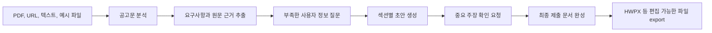

# LiveDock

LiveDock은 공고문을 분석하고, 필요한 사용자 정보를 수집한 뒤, 제출용 문서 초안과 최종 HWPX 파일까지 만들어 주는 문서 자동화 Agent MVP입니다.

사용자는 PDF, URL, 붙여넣은 텍스트, 예시 fixture 또는 HWPX 양식을 제공할 수 있습니다. LiveDock은 공고 요구사항을 근거와 함께 추출하고, 부족한 정보만 질문하고, 섹션별 초안을 만든 뒤, 사용자가 확인해야 할 중요한 주장을 표시합니다. 최종 목표 문서 형식은 한국어 행정 문서에서 자주 쓰이는 HWPX입니다.

Production frontend: [dock-live.vercel.app](https://dock-live.vercel.app)

## 서비스 목적

LiveDock의 현재 우선순위는 커뮤니티 기능이 아니라 Agent MVP입니다.

먼저 안정화하려는 핵심 문제는 다음과 같습니다.

- 공고문을 읽고 제출 조건을 빠짐없이 파악하기
- 마감일, 자격, 제출 서류, 평가 기준, 지원 혜택을 근거와 함께 정리하기
- 사용자가 작성해야 하는 항목과 추가로 필요한 정보를 식별하기
- 자기소개서, 지원서, 연구계획서, 공문, 신청서 등 제출 문서 초안을 섹션별로 생성하기
- 공식 HWPX 양식의 표, 스타일, 구조를 최대한 유지한 채 새 문서를 만들기

장기적으로는 공모전, 장학금, 연구, 창업지원, 대외활동을 찾고 참여하는 학생 중심 커뮤니티로 확장할 수 있습니다. 하지만 현재 제품의 중심은 문서 자동화 Agent입니다.

## 지원하려는 문서 흐름



Agent는 공고 원문에 없는 마감일, 자격 조건, 금액, 기관명, 제출 방법을 임의로 만들어서는 안 됩니다. 불확실한 항목은 `uncertain_fields`나 `confirmation_required`로 남기고 사용자 확인을 요청해야 합니다.

## 현재 MVP 범위

- Next.js 프론트엔드: 공고 업로드, 사용자 프로필 입력, 분석 결과 확인, Agent 흐름 미리보기
- FastAPI 백엔드: 문서 파싱, 공고 분석, 초안 생성, workflow 상태 관리, export API
- AI Provider 계층: OpenAI 기본 사용, 환경변수 설정을 통해 Gemma/Gemini 계열 모델 연동 가능
- Pydantic 스키마: 분석 결과, 체크리스트, 초안, workflow 응답 구조 검증
- 공고 fixture: 공모전, 장학금, 창업지원, 연구 프로그램, 모호한 URL 공고 예시
- HWPX export: 템플릿 클로닝, 텍스트 치환, namespace fix, validate 흐름
- `.claude/skills`와 `tools/hwp-mcp`: Agent, HWPX, HWP MCP 운영을 위한 로컬 자동화 도구

## 파일과 폴더 구조

```text
LiveDock/
  frontend/                    Next.js 14 프론트엔드
    app/                       App Router 페이지와 레이아웃
    components/                업로드, 체크리스트, 타임라인, 문서 UI 컴포넌트
    lib/                       API client, result cache, 공유 타입
    vercel.json                Vercel 프론트엔드 배포 설정

  backend/                     FastAPI 백엔드와 Agent workflow API
    core/                      런타임 설정, 공통 error helper
    models/                    Pydantic request/response schema
    routers/                   analyze, demo, workflow API route
    services/                  파싱, AI provider, draft, storage, export 로직
    tests/                     Agent 계약 테스트와 수동 HWPX 생성 테스트

  docs/                        제품, 아키텍처, 배포, 평가, HWPX 문서
    fixtures/                  대표 공고 JSON fixture
    examples/withus_hwpx/      HWPX 예시 파일과 치환 mapping

  .claude/                     로컬 Agent skill과 MCP 설정 예시
    skills/                    LiveDock 전용 Agent/HWPX workflow skill
    mcp/                       HWP MCP 로컬 설정 가이드

  tools/hwp-mcp/               HWP MCP 서버와 한글 자동화 helper
  AGENTS.md                    Codex 개발 규칙과 Agent MVP 지침
  render.yaml                  Render 백엔드 배포 설정
  README.md                    GitHub 메인 소개 문서
```

다음 폴더는 생성물, 캐시, 의존성이라 제품 소스에 포함하지 않습니다.

- `frontend/node_modules/`
- `frontend/.next/`
- `backend/venv/`
- `__pycache__/`
- `outputs/`
- `.uv-cache/`

## HWPX 생성 전략

LiveDock에서 HWPX는 최종 한국어 편집 문서의 핵심 export 형식입니다.

기본 원칙은 다음과 같습니다.

- HWPX는 XML 파일들을 담은 ZIP package로 다룹니다.
- 복잡한 공식 양식은 XML을 새로 만드는 것보다 사용자가 제공한 `.hwpx` 템플릿을 복제하고 필요한 텍스트를 치환합니다.
- 표, 스타일, 이미지, 문단 구조, run 구조를 최대한 보존합니다.
- 생성 후에는 namespace fix와 validation을 통과해야 준비 완료로 봅니다.
- 사용자가 `.hwp`를 제공하면 먼저 `.hwpx`로 변환한 뒤 처리합니다.

관련 문서:

- [Gemma, skills, MCP, HWPX workflow](./docs/GEMMA_HWPX_WORKFLOW.md)
- [HWP MCP guide](./docs/HWP_MCP_GUIDE.md)
- [Skills and MCP architecture](./docs/SKILLS_MCP_ARCHITECTURE.md)
- [withUS HWPX example](./docs/examples/withus_hwpx/README.md)

## 빠른 실행

Backend:

```powershell
cd backend
python -m venv venv
.\venv\Scripts\activate
pip install -r requirements.txt
copy .env.example .env
python -m uvicorn main:app --reload
```

Frontend:

```powershell
cd frontend
npm install
copy .env.example .env.local
npm run dev
```

기본 로컬 주소:

- Frontend: `http://localhost:3000`
- Backend: `http://localhost:8000`
- Backend health check: `http://localhost:8000/health`

## 환경변수

백엔드는 [backend/.env.example](./backend/.env.example)을 기준으로 `backend/.env`를 만듭니다.

주요 백엔드 값:

- `AI_PROVIDER`: 기본값은 `openai`, Gemma/Gemini 계열 사용 시 `gemma`
- `OPENAI_API_KEY`: OpenAI provider 사용 시 필요
- `GEMINI_API_KEY`: `AI_PROVIDER=gemma` 사용 시 필요
- `MOCK_MODE`: demo 동작 사용 여부
- `REDIS_URL`: workflow 결과 저장용 선택 설정
- `HWPX_EXPORT_ENABLED`: HWPX export toolchain 사용 여부
- `HWPX_SKILL_DIR`: 로컬 HWPX skill 경로

프론트엔드는 [frontend/.env.example](./frontend/.env.example)을 기준으로 `frontend/.env.local`을 만듭니다.

주요 프론트엔드 값:

- `NEXT_PUBLIC_API_URL`: 백엔드 API base URL

실제 `.env`와 `.env.local` 파일은 커밋하지 않습니다.

## 검증 명령

Frontend build:

```powershell
cd frontend
npm run build
```

Backend contract test:

```powershell
cd backend
python -m pytest tests/test_agent_mvp_contracts.py
```

Manual HWPX generation test:

```powershell
cd backend
python tests/manual_hwpx_soccer_application.py
```

## 문서 바로가기

- [Docs index](./docs/README.md)
- [Product plan](./docs/PRODUCT_PLAN.md)
- [Architecture](./docs/ARCHITECTURE.md)
- [Environment setup](./docs/ENVIRONMENT.md)
- [Deployment](./docs/DEPLOYMENT.md)
- [Evaluation fixtures](./docs/EVALS.md)
- [Codex project guide](./AGENTS.md)
