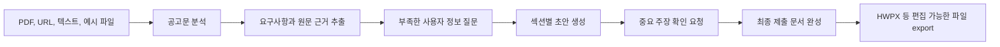

# LiveDock

LiveDock은 공고문을 분석하고, 필요한 사용자 정보를 수집한 뒤, 제출용 문서 초안과 최종 HWPX 파일까지 만들어 주는 문서 자동화 Agent MVP입니다.

사용자는 PDF, URL, 붙여넣은 텍스트, 예시 fixture 또는 HWPX 양식을 제공할 수 있습니다. LiveDock은 공고 요구사항을 근거와 함께 추출하고, 부족한 정보만 질문하고, 섹션별 초안을 만든 뒤, 사용자가 확인해야 할 중요한 주장을 표시합니다. 최종 목표 문서 형식은 한국어 행정 문서에서 자주 쓰이는 HWPX입니다.

Production frontend: [dock-live.vercel.app](https://dock-live.vercel.app)

## 핵심 방향

현재 우선순위는 커뮤니티 기능이 아니라 Agent MVP입니다.

LiveDock이 먼저 안정화해야 하는 일은 다음과 같습니다.

- 공고문에서 마감일, 자격, 제출 서류, 평가 기준, 혜택, 주의사항을 근거와 함께 추출하기
- 사용자가 작성해야 하는 항목과 추가로 필요한 정보를 식별하기
- 자기소개서, 지원서, 연구계획서, 공문, 신청서 등 제출 문서 초안을 섹션별로 생성하기
- 중요한 주장과 불확실한 정보는 사용자 확인을 받은 뒤 최종 문서에 반영하기
- 공식 HWPX 양식의 표, 스타일, 문단 구조를 최대한 유지하면서 새 문서를 생성하기

## Agent Workflow



Agent는 공고 원문에 없는 마감일, 자격 조건, 금액, 기관명, 제출 방법을 임의로 만들지 않습니다. 불확실한 항목은 `uncertain_fields` 또는 `confirmation_required`로 남기고 사용자 확인을 요청합니다.

## 폴더 구조

```text
LiveDock/
  README.md                    GitHub 메인 소개 문서
  AGENTS.md                    Codex 개발 규칙과 Agent MVP 지침
  render.yaml                  Render 백엔드 배포 설정

  frontend/                    Next.js 14 프론트엔드
    README.md                  프론트엔드 실행/구조 안내
    app/                       App Router 페이지와 레이아웃
    components/                업로드, 체크리스트, 타임라인, 문서 UI
    lib/                       API client, result cache, 공유 타입
    vercel.json                Vercel 프론트엔드 배포 설정

  backend/                     FastAPI 백엔드와 Agent workflow API
    README.md                  백엔드 실행/구조 안내
    core/                      런타임 설정, 공통 error helper
    models/                    Pydantic request/response schema
    routers/                   analyze, demo, workflow API route
    services/                  파싱, AI provider, draft, storage, export 로직
    tests/
      contracts/               Agent API/schema 계약 테스트
      manual/                  HWPX 생성 수동 검증 스크립트

  docs/                        제품, 개발, Agent, HWPX, 평가 문서
    README.md                  문서 인덱스
    product/                   제품 방향, 개발 계획, 작업 목록, 디자인 메모
    engineering/               아키텍처, 환경변수, 배포, Codex 운영 문서
    agent/                     Agent harness, skills, MCP 운영 문서
    hwpx/                      HWPX export, Gemma, HWP MCP 문서
    evaluation/                평가 기준과 fixture
    examples/                  HWPX 예시 산출물과 mapping

  .claude/                     Claude/Codex 로컬 자동화 설정
    README.md                  로컬 skills/MCP 안내
    skills/                    LiveDock 전용 Agent/HWPX workflow skill
    mcp/                       HWP MCP 로컬 설정 예시

  tools/                       로컬 보조 도구
    README.md                  도구 폴더 안내
    hwp-mcp/                   Windows HWP 자동화 MCP 서버
      README.md                HWP MCP 도구 안내
      hwp_mcp_stdio_server.py  MCP stdio 서버 entrypoint
      src/                     HWP 제어와 command parser 소스
      tests/                   HWP MCP 단위 테스트
      docs/                    HWP MCP 내부 구조 문서
      security_module/         한글 보안 모듈 예시 DLL
```

## 폴더 역할 요약

| 위치 | 역할 |
| --- | --- |
| `frontend/` | 사용자가 공고를 업로드하고 분석 결과, 체크리스트, 초안, export 흐름을 확인하는 Next.js 앱 |
| `backend/` | 공고 파싱, AI 분석, draft 생성, workflow 상태 관리, HWPX export API를 담당하는 FastAPI 서버 |
| `docs/` | 제품 방향, 아키텍처, 배포, 평가, HWPX, skills/MCP 문서를 범주별로 보관 |
| `.claude/` | LiveDock 업무에 맞춘 로컬 Agent skill과 MCP 설정 예시 |
| `tools/hwp-mcp/` | Windows 한글 프로그램을 제어하기 위한 로컬 MCP helper |

## 포함하지 않는 로컬 생성물

다음은 실행 중 생기는 캐시, 의존성, 개인 환경 파일이라 GitHub에 올리지 않습니다.

- `frontend/node_modules/`
- `frontend/.next/`
- `frontend/.env.local`
- `backend/venv/`
- `backend/.env`
- `__pycache__/`
- `outputs/`
- `.uv-cache/`
- `tools/hwp-mcp/.venv/`
- `tools/hwp-mcp/*.log`

## HWPX 생성 전략

LiveDock에서 HWPX는 최종 한국어 편집 문서의 핵심 export 형식입니다.

- HWPX는 XML 파일들을 담은 ZIP package로 다룹니다.
- 복잡한 공식 양식은 사용자가 제공한 `.hwpx` 템플릿을 복제하고 필요한 텍스트를 치환합니다.
- 표, 스타일, 이미지, 문단 구조, run 구조를 최대한 보존합니다.
- 생성 후에는 namespace fix와 validation을 통과해야 준비 완료로 봅니다.
- 사용자가 `.hwp`를 제공하면 먼저 `.hwpx`로 변환한 뒤 처리합니다.

관련 문서:

- [Gemma, skills, MCP, HWPX workflow](./docs/hwpx/gemma-hwpx-workflow.md)
- [HWP MCP guide](./docs/hwpx/hwp-mcp-guide.md)
- [Skills and MCP architecture](./docs/agent/skills-mcp-architecture.md)
- [withUS HWPX example](./docs/examples/withus-hwpx/README.md)

## 빠른 실행

Backend:

```powershell
cd backend
python -m venv venv
.\venv\Scripts\activate
pip install -r requirements.txt
copy .env.example .env
python -m uvicorn main:app --reload
```

Frontend:

```powershell
cd frontend
npm install
copy .env.example .env.local
npm run dev
```

기본 로컬 주소:

- Frontend: `http://localhost:3000`
- Backend: `http://localhost:8000`
- Backend health check: `http://localhost:8000/health`

## 환경변수

백엔드는 [backend/.env.example](./backend/.env.example)을 기준으로 `backend/.env`를 만듭니다.

주요 백엔드 값:

- `AI_PROVIDER`: 기본값은 `openai`, Gemma/Gemini 계열 사용 시 `gemma`
- `OPENAI_API_KEY`: OpenAI provider 사용 시 필요
- `GEMINI_API_KEY`: `AI_PROVIDER=gemma` 사용 시 필요
- `MOCK_MODE`: demo 동작 사용 여부
- `REDIS_URL`: workflow 결과 저장용 선택 설정
- `HWPX_EXPORT_ENABLED`: HWPX export toolchain 사용 여부
- `HWPX_SKILL_DIR`: 로컬 HWPX skill 경로

프론트엔드는 [frontend/.env.example](./frontend/.env.example)을 기준으로 `frontend/.env.local`을 만듭니다.

주요 프론트엔드 값:

- `NEXT_PUBLIC_API_URL`: 백엔드 API base URL

실제 `.env`와 `.env.local` 파일은 커밋하지 않습니다.

## 검증 명령

Frontend build:

```powershell
cd frontend
npm run build
```

Backend contract test:

```powershell
cd backend
python -m pytest tests/contracts/test_agent_mvp_contracts.py
```

Manual HWPX generation test:

```powershell
cd backend
python tests/manual/manual_hwpx_soccer_application.py
```

## 문서 바로가기

- [Docs index](./docs/README.md)
- [Product plan](./docs/product/product-plan.md)
- [Architecture](./docs/engineering/architecture.md)
- [Environment setup](./docs/engineering/environment.md)
- [Deployment](./docs/engineering/deployment.md)
- [Evaluation guide](./docs/evaluation/evals.md)
- [Codex project guide](./AGENTS.md)
