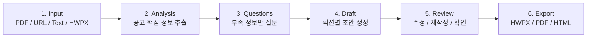
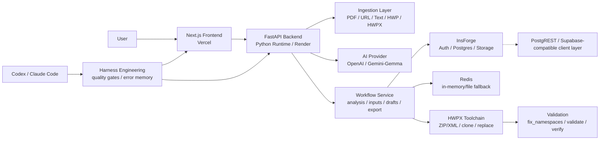

# LiveDock

> 한국 공고문과 HWPX 양식을 제출용 문서로 바꾸는 Agent MVP

공모전, 지원사업, 장학금, 연구과제 공고문을 PDF, URL, 텍스트, HWP/HWPX 양식으로 입력하면 LiveDock이 요구사항을 분석하고, 부족한 정보만 질문한 뒤, 섹션별 초안을 생성해 **HWPX, PDF, HTML**로 내보냅니다.

**Production:** [dock-live.vercel.app](https://dock-live.vercel.app)

---

## 서비스 핵심 개요

LiveDock은 한국형 공고문/행정 양식 작성에 특화된 문서 자동화 Agent입니다. 사용자가 공고문을 하나하나 해석하고 HWPX 양식을 직접 채우는 부담을 줄이는 것이 목표입니다.

핵심 원칙은 **근거 기반 작성**입니다. Agent는 공고 원문에 없는 마감일, 기관명, 지원금, 자격요건, 제출 방법을 임의로 만들지 않습니다. 불확실한 값은 `uncertain_fields` 또는 `confirmation_required`로 남기고 사용자 확인을 요청합니다.

---

## 워크플로우



| 단계 | 역할 | 주요 결과 |
| --- | --- | --- |
| Input | PDF, URL, 텍스트, HWP/HWPX 양식 입력 | 원문 또는 양식 파일 |
| Analysis | 마감일, 자격, 제출서류, 평가기준, 혜택 추출 | `AnalysisResult` |
| Questions | 작성에 필요한 사용자별 누락 정보만 수집 | `UserInputField` |
| Draft | 공고 분석과 사용자 입력을 근거로 섹션별 초안 생성 | `DraftSection` |
| Review | 인라인 편집, AI 재작성, 확인 필요 항목 검토 | `confirmation_required` |
| Export | 최종 문서를 검증 가능한 형식으로 내보내기 | HWPX, PDF, HTML |

---

## MVP 범위

현재 MVP는 커뮤니티나 소셜 기능이 아니라 **공고문 기반 제출 문서 작성**에 집중합니다.

- **문서 입력**: PDF 업로드, URL 수집, 텍스트 붙여넣기, HWP/HWPX 양식 업로드
- **근거 기반 분석**: 원문 evidence를 포함한 구조화 JSON 분석
- **부족 정보 수집**: 사용자에게 꼭 필요한 정보만 질문
- **섹션별 초안 생성**: SSE 스트리밍 기반 초안 생성과 섹션 단위 재작성
- **사용자 확인 게이트**: 불확실한 주장과 제출 전 확인 항목 유지
- **HWPX 중심 export**: HWPX ZIP/XML 생성, namespace fix, validation, verify
- **워크플로우 복구**: 세션 저장, export 이력, 장애 fallback
- **하네스 검증**: backend contract, deterministic agent eval, frontend build, HWPX validation

---

## 기술 아키텍처



### 런타임 책임 분리

- **Frontend**: 업로드, 분석 결과 검토, 사용자 입력, 섹션 초안 리뷰, export UI
- **Backend**: 파싱, AI provider 호출, Pydantic 검증, workflow 상태, export orchestration
- **AI Provider**: 구조화 JSON 분석과 섹션별 초안 생성
- **InsForge**: 사용자/auth, 분석 결과, workflow session, 업로드 문서, 생성 export 저장
- **HWPX Toolchain**: 실제 `.hwpx` 패키지 생성, 공식 양식 clone/replace, 검증
- **Harness**: 반복 가능한 품질 게이트와 오류 fingerprint 관리

---

## 기술 스택

| 영역 | 사용 기술 |
| --- | --- |
| Frontend | Next.js 14 App Router, React 18, TypeScript, Tailwind CSS |
| Frontend State/UI | Zustand, React Dropzone, Framer Motion |
| Backend | FastAPI, Python 3.11+, Pydantic |
| AI | OpenAI API, Gemini/Gemma provider option |
| 문서 파싱 | PyMuPDF, URL ingestion, HWP/HWPX intake |
| HWPX | ZIP/XML toolchain, `lxml`, `python-hwpx`, HWPX clone/replace scripts |
| Persistence | InsForge Auth, Postgres, Storage |
| Data API Layer | PostgREST / Supabase-compatible client layer through InsForge SDK |
| Cache/Fallback | Redis, in-memory/file cache |
| Export | HWPX, PDF, editable HTML fallback |
| Deployment | Vercel frontend, Render or Vercel-compatible Python backend |
| Verification | `scripts/harness.ps1`, backend contracts, agent eval, frontend build, HWPX validation |

---

## 프로젝트 구조

```text
LiveDock/
  frontend/                       Next.js frontend
    app/app/page.tsx              6단계 Agent workflow 메인 화면
    app/app/templates/            HWPX 템플릿 기반 시작 흐름
    components/workspace/         업로드, 진행 상태, 리뷰, HWPX 폼 편집 UI
    lib/api.ts                    FastAPI client
    lib/types.ts                  frontend 공유 타입
    lib/insforge.ts               InsForge SDK client

  backend/                        FastAPI backend
    main.py                       FastAPI entrypoint, CORS, router 등록
    models/schemas.py             Pydantic API contracts
    routers/                      analyze, workflow, hwpx, notices API
    services/analyzer.py          공고문 분석 orchestration
    services/drafting_service.py  섹션 초안, finalize, HWPX export
    services/document_ingestion.py PDF/HWP/HWPX intake
    services/hwpx_form_session.py HWPX 양식 세션 편집
    services/source_preserving_export.py 원본 양식 보존 export
    services/storage.py           InsForge/Redis/fallback 저장소
    hwpx_toolchain/scripts/       HWPX clone, namespace, validate 도구
    tests/contracts/              backend contract tests
    tests/evals/                  deterministic Agent MVP eval

  harness/                        Agent harness
    state-spec.yaml               제품 불변 조건과 Agent 계약
    quality-gates.yaml            quick/backend/agent/frontend/full/hwpx profile
    memory/                       durable project/user workflow memory
    errors/registry.json          반복 실패 fingerprint registry

  docs/                           제품, 아키텍처, 배포, HWPX, 평가 문서
  tools/                          harness runner, handoff, HWP MCP helper
  .claude/skills/                 LiveDock 단계별 Agent skill 정의
```

---

## 주요 API

```text
POST /api/analyze                          PDF/HWP/HWPX 업로드 분석
POST /api/analyze/text                     텍스트 직접 분석
POST /api/analyze/url                      URL 공고 분석
GET  /api/demo                             데모 fixture

GET  /api/workflow/{id}                    workflow session 조회
POST /api/workflow/{id}/inputs             사용자 입력 저장
GET  /api/workflow/{id}/draft/stream       SSE 섹션 초안 생성
POST /api/workflow/{id}/draft/{sid}/revise 섹션 AI 재작성
POST /api/workflow/{id}/confirm            확인 항목 처리
POST /api/workflow/{id}/finalize           최종 문서 생성

GET  /api/workflow/{id}/export/hwpx        HWPX export
GET  /api/workflow/{id}/export/pdf         PDF export
GET  /api/workflow/{id}/export/html        HTML fallback export
GET  /api/hwpx/status                      HWPX toolchain readiness
```

---

## 실행

### Backend

```powershell
cd backend
python -m venv venv
.\venv\Scripts\activate
pip install -r requirements.txt
copy .env.example .env
python -m uvicorn main:app --reload
```

기본 주소는 `http://localhost:8000`입니다.

### Frontend

```powershell
cd frontend
npm install
copy .env.example .env.local
npm run dev
```

기본 주소는 `http://localhost:3000`입니다.

---

## 검증

Repository root에서 하네스 profile을 실행합니다.

```powershell
.\scripts\harness.ps1 -Profile quick
.\scripts\harness.ps1 -Profile agent
.\scripts\harness.ps1 -Profile frontend
.\scripts\harness.ps1 -Profile hwpx
```

| Profile | 목적 |
| --- | --- |
| `quick` | Python compile, harness self-test, backend contract |
| `backend` | backend syntax and contract gate |
| `agent` | deterministic fixture E2E eval |
| `frontend` | frontend tests and production build |
| `full` | backend, agent, frontend 통합 gate |
| `hwpx` | deterministic E2E + HWPX validation |

---

## 문서

- [Architecture](./docs/engineering/architecture.md)
- [Deployment](./docs/engineering/deployment.md)
- [Agent Harness](./docs/agent/agent-harness.md)
- [Skills and Technical Patterns](./docs/agent/skills.md)
- [HWPX Workflow](./docs/hwpx/gemma-hwpx-workflow.md)
- [Evaluation](./docs/evaluation/evals.md)
