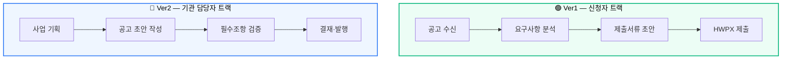
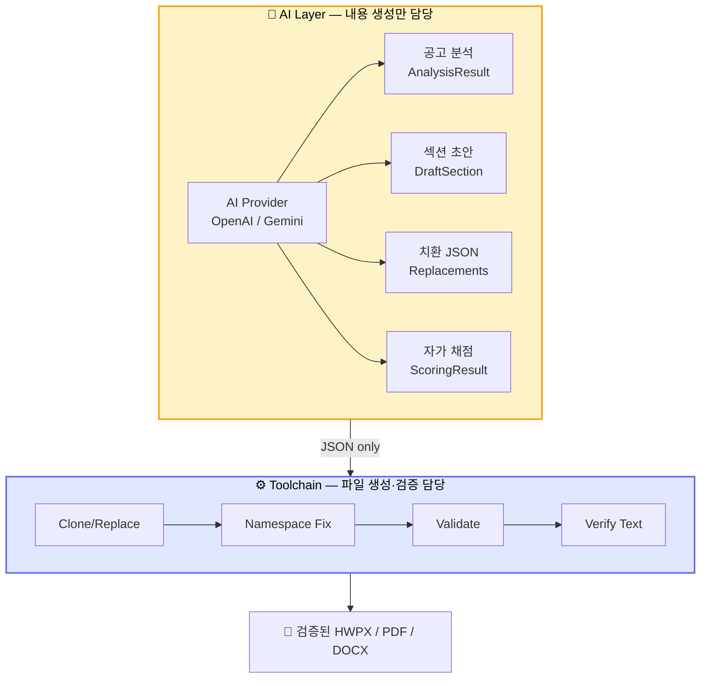
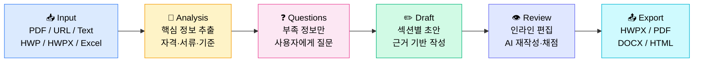
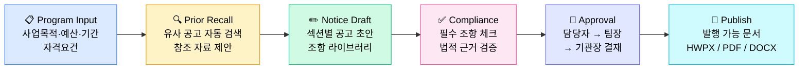
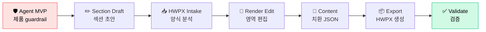
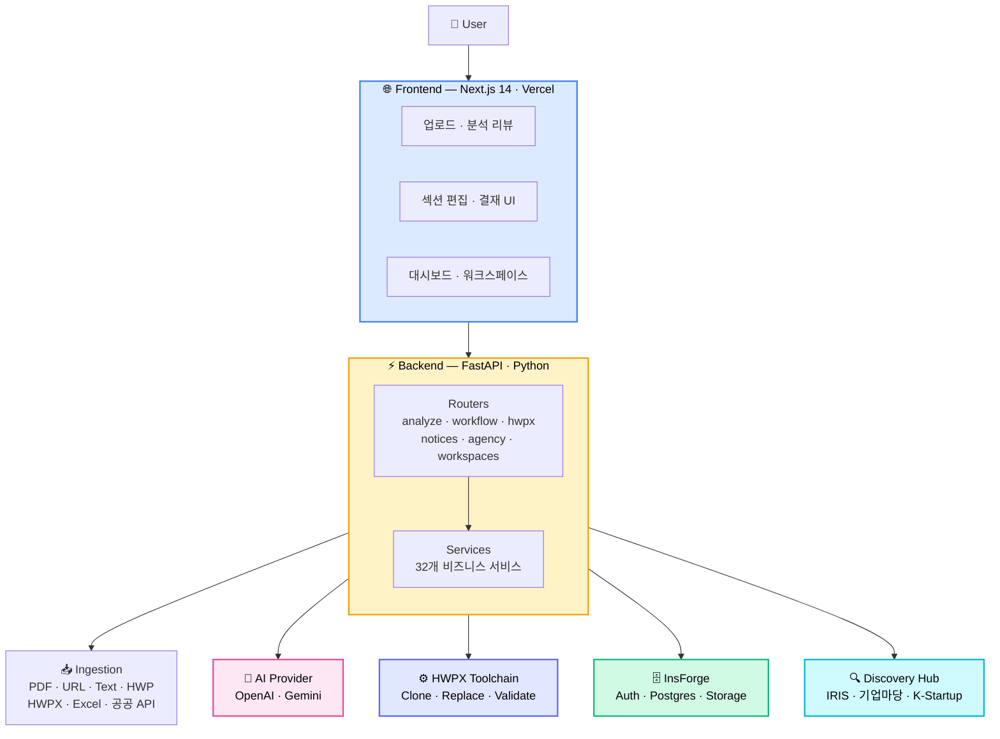

<div align="center">

# 🚀 LiveDock

### AI Agent가 공고문을 분석하고, 제출 문서를 작성합니다

[](https://dock-live.vercel.app)
[](#-기술-스택)
[](#-기술-스택)
[](#-기술-스택)

**공모전 · 지원사업 · 장학금 · 연구과제 · 정부 R&D**

PDF / URL / 텍스트 / HWP / HWPX / 엑셀 로 공고를 입력하면<br/>
AI Agent가 핵심 요구사항을 분석하고, 필요한 정보만 질문한 뒤<br/>
**섹션별 초안을 생성해 HWPX · PDF · DOCX · HTML 로 내보냅니다.**

---

<table>
<tr>
<td align="center"><strong>🧠 근거 기반 작성</strong><br/><sub>원문에 없는 정보는<br/>절대 생성하지 않습니다</sub></td>
<td align="center"><strong>📄 HWPX 네이티브</strong><br/><sub>한국 공문서 양식을<br/>완벽하게 지원합니다</sub></td>
<td align="center"><strong>🔒 확인 게이트</strong><br/><sub>불확실한 항목은<br/>사용자 확인을 요청합니다</sub></td>
<td align="center"><strong>🏛️ 기관 워크플로우</strong><br/><sub>공고 작성→결재→발행<br/>전체 프로세스를 자동화합니다</sub></td>
</tr>
</table>

</div>

---

## 📋 목차

- [서비스 개요](#-서비스-개요)
- [핵심 기능](#-핵심-기능)
- [AI Agent 아키텍처](#-ai-agent-아키텍처)
- [Agent Workflow](#-agent-workflow)
- [HWPX 문서 자동화 파이프라인](#-hwpx-문서-자동화-파이프라인)
- [시스템 아키텍처](#-시스템-아키텍처)
- [기술 스택](#-기술-스택)
- [프로젝트 구조](#-프로젝트-구조)
- [시작하기](#-시작하기)
- [문서](#-문서)

---

## 🎯 서비스 개요

LiveDock은 **한국 공고문과 행정 양식 작성에 특화된 AI Agent 플랫폼**입니다.

### 해결하는 문제

> 💡 공고문을 하나하나 해석하고, HWP 양식을 직접 채우고, 기관 내부 결재까지 받는 데 드는 시간과 노력을 획기적으로 줄입니다.

| 기존 방식 | LiveDock |
|:---------:|:--------:|
| 📖 공고문을 수작업으로 읽고 해석 | 🤖 AI가 핵심 정보를 **자동 추출** |
| ✍️ HWP 양식을 직접 하나하나 채움 | 📝 섹션별 초안을 **자동 생성** |
| ❓ 불확실한 내용을 임의로 작성 | ✅ 근거 없는 내용은 **확인 요청** |
| 📂 이전 공고를 수동으로 검색/참조 | 🔍 유사 공고를 **자동 검색/참조** |
| 📮 메일/결재로 검토 과정 진행 | 🔄 **인라인 결재 워크플로우** |

---

### 듀얼 트랙 서비스 구조

LiveDock은 **두 가지 사용자 트랙**을 동시에 지원합니다:


```mermaid
flowchart TB
    subgraph V1["🟢 Ver1 — 신청자 트랙"]
        direction LR
        A1["공고 수신"] --> A2["요구사항 분석"] --> A3["제출서류 초안"] --> A4["HWPX 제출"]
    end

    subgraph V2["🔵 Ver2 — 기관 담당자 트랙"]
        direction LR
        B1["사업 기획"] --> B2["공고 초안 작성"] --> B3["필수조항 검증"] --> B4["결재·발행"]
    end

    style V1 fill:#ecfdf5,stroke:#10b981,stroke-width:2px,color:#000
    style V2 fill:#eff6ff,stroke:#3b82f6,stroke-width:2px,color:#000
```

| | Ver1 · 신청자 트랙 | Ver2 · 기관 담당자 트랙 |
|---|---|---|
| **대상 사용자** | 기업, 대학, 연구팀, 개인 | 기관 담당자 → 팀장 → 기관장 |
| **핵심 입력** | 기존 공고문 + 신청자 정보 | 사업 목적, 예산, 기간, 자격요건 + 이전 연도 공고 |
| **핵심 출력** | 사업계획서/지원서 제출 초안 | 공고문 초안, 발행 가능 문서 |
| **차별화** | 근거 기반 작성, 확인 게이트 | 내부 결재, 버전 관리, 감사 추적 |

---

## ✨ 핵심 기능

### 🤖 AI Agent 핵심

<table>
<tr>
<td width="50%">

**📥 멀티포맷 문서 수집**
- PDF, URL, 텍스트, HWP, HWPX, 엑셀 입력
- IRIS · 기업마당 · K-Startup 공고 자동 연동
- 첨부 파일(CSV/XLSX) 자동 파싱 및 구조화

</td>
<td width="50%">

**🔬 공고 분석 엔진**
- 마감일, 자격요건, 제출서류, 평가기준, 혜택 추출
- `AnalysisResult` 구조화 JSON 생성
- 평가 루브릭 기반 **AI 자동 스코어링**

</td>
</tr>
<tr>
<td>

**✏️ 섹션별 초안 생성**
- 사업개요, 지원내용, 신청자격, 제출서류 등
- 근거 기반: 원문에 없는 정보 생성 금지
- AI 섹션 재작성 (커스텀 지시사항 지원)

</td>
<td>

**📤 멀티포맷 내보내기**
- HWPX (한국 표준 문서 형식)
- PDF, DOCX, HTML, Markdown
- 공식 양식 clone/replace 방식 보존

</td>
</tr>
</table>

---

### 🏛️ 기관 워크플로우 (Ver2)

<table>
<tr>
<td width="50%">

**📋 공고 작성 Agent**
- 구조화 입력 → 섹션별 공고 초안 생성
- 다중 레시피: 지원사업, 학부연구생 모집 등
- 블록 기반 문서 모델 (테이블, 차트, 연락처 등)

</td>
<td width="50%">

**🔍 이전 공고 검색 (Prior-Notice Recall)**
- 임베딩 기반 시맨틱 유사도 검색
- 하이브리드 스코어링 (코사인 + Jaccard + 메타 매칭)
- 예산 구간별 자동 분류 및 필터링

</td>
</tr>
<tr>
<td>

**✅ 결재 워크플로우 & 감사 추적**
- `draft → under_review → approving → approved → published`
- 버전별 diff 비교 + 섹션별 코멘트 스레드
- 모든 액션 기록 (누가, 언제, 무엇을)

</td>
<td>

**📚 필수 조항 라이브러리**
- 조직별 재사용 가능한 조항 템플릿
- 법적 근거, 개인정보 처리방침, 공정경쟁 문구 등
- 프로그램 유형별 필수 조항 컴플라이언스 게이트

</td>
</tr>
</table>

---

### 🔗 공고 디스커버리 허브

**3개 정부 데이터 소스**에서 공고를 실시간으로 수집하고 탐색합니다:

| 소스 | 대상 | 기능 |
|------|------|------|
| 🔬 **IRIS** (iris.go.kr) | 정부 R&D 과제 | 키워드 검색, 접수 상태 필터, 상세 파싱 |
| 🏢 **기업마당** (bizinfo.go.kr) | 중소기업 지원사업 | 공공 API 연동, 분류/부처/기관 필터 |
| 🚀 **K-Startup** (data.go.kr) | 스타트업 지원 공고 | 모집 상태, 지역, 연령, 사업경력 필터 |

- 🔄 **15분 TTL 캐싱** — 통합 `DiscoveredNotice` 스키마
- 📌 **원클릭 참조 저장** — 발견한 공고를 즉시 작성 참조 자료로 활용
- 📊 **프로필 매칭 정렬** — 조직 프로필 기반 관련도 자동 평가

---

### 🛠️ 문서 작업 공간

<table>
<tr>
<td width="50%">

**📁 멀티파일 워크스페이스**
- 다중 파일 업로드 (PDF, HWP, HWPX, 엑셀, 이미지)
- 파일 종류 자동 분류 (공고, 참조, 스프레드시트)
- 워크스페이스 단위 프로젝트 관리

</td>
<td width="50%">

**📊 Blueprint & 문서 생성**
- 분석 결과 + 업로드 데이터 기반 문서 구조 자동 기획
- 테이블/차트 시각화 자동 생성
- AI 문단 합성 (워크스페이스 사실만 사용)

</td>
</tr>
<tr>
<td>

**📈 Excel 아티팩트**
- 대시보드/제출서류/차트/원문근거 멀티시트 생성
- openpyxl 기반 스타일링 + 네이티브 차트
- 데스크탑 양방향 동기화 (편집 후 sync-back)

</td>
<td>

**🔗 근거 추적 & 스코어링**
- 모든 생성 섹션에 입력 근거 ID 연결
- 평가 루브릭 기반 AI 자가 채점
- 기준별 점수/약점/개선 제안 제공

</td>
</tr>
</table>

---

## 🧠 AI Agent 아키텍처

LiveDock의 AI는 **"AI가 문서를 직접 만드는 구조"가 아닙니다.**

> AI는 **내용 분석과 치환 JSON만** 생성하고, 실제 파일 생성과 검증은 HWPX 툴체인이 담당합니다.


```mermaid
flowchart TB
    subgraph AI["🧠 AI Layer — 내용 생성만 담당"]
        direction LR
        P["AI Provider<br/>OpenAI / Gemini"] --> AN["공고 분석<br/>AnalysisResult"]
        P --> DR["섹션 초안<br/>DraftSection"]
        P --> CL["치환 JSON<br/>Replacements"]
        P --> SC["자가 채점<br/>ScoringResult"]
    end

    subgraph TC["⚙️ Toolchain — 파일 생성·검증 담당"]
        direction LR
        CL2["Clone/Replace"] --> FX["Namespace Fix"] --> VL["Validate"] --> VR["Verify Text"]
    end

    AI -->|"JSON only"| TC
    TC --> OUT["📄 검증된 HWPX / PDF / DOCX"]

    style AI fill:#fef3c7,stroke:#f59e0b,stroke-width:2px,color:#000
    style TC fill:#e0e7ff,stroke:#6366f1,stroke-width:2px,color:#000
```

### 핵심 설계 원칙

| 원칙 | 구현 |
|------|------|
| **🚫 팩트 생성 금지** | 마감일, 기관명, 지원금, 법적 근거 등 원문에 없는 사실은 생성하지 않음 |
| **❓ 불확실성 표시** | `uncertain_fields`, `confirmation_required`로 분류 후 사용자 확인 요청 |
| **🔀 관심사 분리** | AI → 내용 JSON, Toolchain → 파일 생성, Frontend → 사용자 검토 |
| **🔒 Provider 추상화** | 조직별 승인된 AI 모델 지정 가능 (OpenAI / Gemini / 커스텀) |
| **📎 근거 추적** | 모든 생성 콘텐츠에 `source_evidence_ids` + `source_traces` 연결 |

---

## 🔄 Agent Workflow

### Ver1 — 신청자 워크플로우


```mermaid
flowchart LR
    A["📥 Input<br/>PDF / URL / Text<br/>HWP / HWPX / Excel"]
    B["🔬 Analysis<br/>핵심 정보 추출<br/>자격·서류·기준"]
    C["❓ Questions<br/>부족 정보만<br/>사용자에게 질문"]
    D["✏️ Draft<br/>섹션별 초안<br/>근거 기반 작성"]
    E["👁️ Review<br/>인라인 편집<br/>AI 재작성·채점"]
    F["📤 Export<br/>HWPX / PDF<br/>DOCX / HTML"]

    A --> B --> C --> D --> E --> F

    style A fill:#dbeafe,stroke:#3b82f6,color:#000
    style B fill:#fef3c7,stroke:#f59e0b,color:#000
    style C fill:#fce7f3,stroke:#ec4899,color:#000
    style D fill:#d1fae5,stroke:#10b981,color:#000
    style E fill:#e0e7ff,stroke:#6366f1,color:#000
    style F fill:#cffafe,stroke:#06b6d4,color:#000
```

| 단계 | 역할 | 출력 |
|------|------|------|
| **Input** | 다중 형식 문서 수집 + 공고 디스커버리 허브 | 원문 텍스트 + 첨부 데이터 |
| **Analysis** | 마감일, 자격, 서류, 평가기준, 혜택 추출 | `AnalysisResult` |
| **Questions** | 작성에 필요한 누락 정보만 질문 | `UserInputField` |
| **Draft** | 공고 분석 + 사용자 입력 기반 섹션 초안 | `DraftSection` + source trace |
| **Review** | 인라인 편집, AI 재작성, 루브릭 자가 채점 | 확정된 초안 + 스코어 |
| **Export** | 검증된 형식으로 최종 문서 생성 | HWPX, PDF, DOCX, HTML, MD |

### Ver2 — 기관 담당자 워크플로우


```mermaid
flowchart LR
    A["📋 Program Input<br/>사업목적·예산·기간<br/>자격요건"]
    B["🔍 Prior Recall<br/>유사 공고 자동 검색<br/>참조 자료 제안"]
    C["✏️ Notice Draft<br/>섹션별 공고 초안<br/>조항 라이브러리"]
    D["✅ Compliance<br/>필수 조항 체크<br/>법적 근거 검증"]
    E["🔄 Approval<br/>담당자 → 팀장<br/>→ 기관장 결재"]
    F["📢 Publish<br/>발행 가능 문서<br/>HWPX / PDF / DOCX"]

    A --> B --> C --> D --> E --> F

    style A fill:#dbeafe,stroke:#3b82f6,color:#000
    style B fill:#fef3c7,stroke:#f59e0b,color:#000
    style C fill:#d1fae5,stroke:#10b981,color:#000
    style D fill:#fce7f3,stroke:#ec4899,color:#000
    style E fill:#e0e7ff,stroke:#6366f1,color:#000
    style F fill:#cffafe,stroke:#06b6d4,color:#000
```

---

## 📄 HWPX 문서 자동화 파이프라인

AI Agent가 단계별 **Skill 체인**을 통해 안전하게 문서를 생성합니다:


```mermaid
flowchart LR
    S1["🛡️ Agent MVP<br/>제품 guardrail"]
    S2["✏️ Section Draft<br/>섹션 초안"]
    S3["📥 HWPX Intake<br/>양식 분석"]
    S4["🎨 Render Edit<br/>영역 편집"]
    S5["📝 Content<br/>치환 JSON"]
    S6["📦 Export<br/>HWPX 생성"]
    S7["✅ Validate<br/>검증"]

    S1 --> S2 --> S3 --> S4 --> S5 --> S6 --> S7

    style S1 fill:#fee2e2,stroke:#ef4444,color:#000
    style S7 fill:#d1fae5,stroke:#10b981,color:#000
```

<details>
<summary><strong>📖 Skill 상세 설명</strong></summary>

| Skill | 역할 | 핵심 책임 |
|-------|------|-----------|
| `livedock-agent-mvp` | 제품 범위 고정 | 분석 → 질문 → 초안 → 확인 게이트 → export 흐름 유지 |
| `livedock-section-draft` | 섹션별 초안 | `AnalysisResult` + 사용자 입력으로 초안 생성, `confirmation_required` 유지 |
| `livedock-hwpx-intake` | 양식 분석 | HWP→HWPX 변환, 표/이미지/placeholder 구조 분석 |
| `livedock-hwpx-render-edit` | 영역 편집 | HWPX 미리보기, `source_ref` 기반 XML 치환 대상 관리 |
| `livedock-hwpx-content` | 치환 JSON 생성 | `replacements`, `keywords`, `section_content` 데이터만 생성 |
| `livedock-hwpx-export` | HWPX 생성 | Markdown→HWPX 또는 공식 양식 clone/replace |
| `livedock-hwpx-validate` | 품질 검증 | namespace fix → validate → text extraction 검증 |

</details>

---

## 🏗️ 시스템 아키텍처


```mermaid
flowchart TB
    U["👤 User"] --> FE

    subgraph FE["🌐 Frontend — Next.js 14 · Vercel"]
        direction LR
        FE1["업로드 · 분석 리뷰"]
        FE2["섹션 편집 · 결재 UI"]
        FE3["대시보드 · 워크스페이스"]
    end

    FE --> API

    subgraph API["⚡ Backend — FastAPI · Python"]
        direction TB
        R["Routers<br/>analyze · workflow · hwpx<br/>notices · agency · workspaces"]
        S["Services<br/>32개 비즈니스 서비스"]
        R --> S
    end

    API --> ING["📥 Ingestion<br/>PDF · URL · Text · HWP<br/>HWPX · Excel · 공공 API"]
    API --> AI["🧠 AI Provider<br/>OpenAI · Gemini"]
    API --> HWPX["⚙️ HWPX Toolchain<br/>Clone · Replace · Validate"]
    API --> DB["🗄️ InsForge<br/>Auth · Postgres · Storage"]
    API --> DISC["🔍 Discovery Hub<br/>IRIS · 기업마당 · K-Startup"]

    style FE fill:#dbeafe,stroke:#3b82f6,stroke-width:2px,color:#000
    style API fill:#fef3c7,stroke:#f59e0b,stroke-width:2px,color:#000
    style AI fill:#fce7f3,stroke:#ec4899,stroke-width:2px,color:#000
    style HWPX fill:#e0e7ff,stroke:#6366f1,stroke-width:2px,color:#000
    style DB fill:#d1fae5,stroke:#10b981,stroke-width:2px,color:#000
    style DISC fill:#cffafe,stroke:#06b6d4,stroke-width:2px,color:#000
```

### 런타임 책임 분리

| 계층 | 책임 |
|------|------|
| **Frontend** | 업로드, 분석 결과 검토, 사용자 입력, 섹션 초안 리뷰, 결재 UI, export |
| **Backend** | 파싱, AI provider 호출, Pydantic 검증, workflow 상태, export 오케스트레이션 |
| **AI Provider** | 구조화 JSON 분석, 섹션별 초안/재작성/스코어링 (내용 생성만 담당) |
| **InsForge** | Auth, 분석 결과, workflow session, 문서 저장, 조직/결재/감사 데이터 |
| **HWPX Toolchain** | `.hwpx` 패키지 생성, 공식 양식 clone/replace, namespace 검증 |
| **Discovery Hub** | IRIS/기업마당/K-Startup 공고 수집, 캐싱, 프로필 매칭 |

---

## 🛠️ 기술 스택

<table>
<tr>
<td>

### Frontend


Zustand · Framer Motion · React Dropzone · JSZip

</td>
<td>

### Backend


PyMuPDF · lxml · python-hwpx · httpx · Redis

</td>
</tr>
<tr>
<td>

### AI & 문서


HWPX ZIP/XML Toolchain · python-docx · openpyxl

</td>
<td>

### Infrastructure


InsForge (Auth · Postgres · Storage) · Redis · TossPayments

</td>
</tr>
</table>

---

## 📁 프로젝트 구조

```
LiveDock/
├── 🌐 frontend/                    Next.js 14 프론트엔드
│   ├── app/                        App Router (auth, dashboard, workspace, result, hwpx)
│   ├── components/                 UI 컴포넌트 (20개 모듈)
│   │   ├── agency/                 기관 워크플로우 (결재, 공고 편집)
│   │   ├── dashboard/              대시보드 (프로젝트 목록, 통계)
│   │   ├── document/               문서 편집 (인라인 수정, AI 재작성)
│   │   ├── livedock/               핵심 Agent UI (분석, 초안, 리뷰)
│   │   ├── pipeline/               파이프라인 UI (단계별 진행)
│   │   ├── workspace/              워크스페이스 (멀티파일, 블루프린트)
│   │   └── ui/                     공통 UI (버튼, 카드, 모달)
│   ├── lib/                        API 클라이언트, 타입, 상태 관리
│   └── hooks/                      커스텀 React hooks
│
├── ⚡ backend/                     FastAPI Agent 백엔드
│   ├── main.py                     앱 엔트리포인트
│   ├── routers/                    API 라우터 (8개)
│   │   ├── agency.py               기관 기능 (공고 작성, 결재, 조항 라이브러리)
│   │   ├── workflow.py             워크플로우 (분석→초안→export 전체 흐름)
│   │   ├── hwpx.py                 HWPX (양식 분석, 생성, 검증)
│   │   ├── notices.py              공고 관리 + 디스커버리 허브
│   │   └── workspaces.py           워크스페이스 (멀티파일, 블루프린트, 생성)
│   ├── services/                   비즈니스 로직 (32개 서비스)
│   │   ├── analyzer.py             공고 분석 엔진
│   │   ├── drafting_service.py     섹션별 초안 생성
│   │   ├── agency_noticeops.py     기관 공고 운영 + 결재 상태머신
│   │   ├── prior_notice_recall.py  시맨틱 유사 공고 검색
│   │   ├── blueprint_service.py    문서 구조 자동 기획
│   │   ├── scoring_service.py      루브릭 기반 AI 자가 채점
│   │   ├── excel_artifacts.py      Excel 아티팩트 생성/동기화
│   │   ├── iris_ingestion.py       IRIS 공고 수집
│   │   ├── bizinfo_ingestion.py    기업마당 공고 수집
│   │   ├── kstartup_ingestion.py   K-Startup 공고 수집
│   │   └── storage.py              InsForge 파일 저장소
│   ├── hwpx_toolchain/             HWPX 변환·검증 도구 체인
│   └── models/schemas.py           Pydantic API 스키마 (37KB)
│
├── 🤖 docklive-inline-agent/       인라인 Agent (Python, 독립 실행)
├── 🗃️ migrations/                  InsForge/Postgres 마이그레이션 (6개)
├── 🔧 harness/                     Agent 품질 게이트·검증 시스템
│   ├── state-spec.yaml             제품 불변 조건과 Agent 계약
│   ├── quality-gates.yaml          품질 프로파일 (quick/backend/agent/frontend/full/hwpx)
│   ├── memory/                     프로젝트·워크플로우 메모리
│   ├── errors/                     반복 실패 레지스트리
│   └── roles/                      Agent 역할 정의
├── 📚 docs/                        프로젝트 문서 (아키텍처, 배포, 스킬, HWPX, 평가)
├── 🛠️ tools/                       개발 보조 도구 (하네스, HWP MCP, 엑셀 헬퍼)
└── 📜 scripts/                     실행 스크립트 (하네스, 개발 서버, 핸드오프)
```

---

## 🚀 시작하기

### 필수 요구사항

- **Node.js** 18+ / **npm** 9+
- **Python** 3.11+
- **OpenAI API Key** 또는 **Gemini API Key**

### 로컬 개발 환경

```bash
# 1. 레포지토리 클론
git clone https://github.com/mingyugim090-debug/DockLive.git
cd DockLive

# 2. 환경 변수 설정
cp .env.local.example .env.local
# → OpenAI API Key, InsForge Key 등 입력

# 3. Backend 실행
cd backend
pip install -r requirements.txt
uvicorn main:app --reload --port 8000

# 4. Frontend 실행 (새 터미널)
cd frontend
npm install
npm run dev
```

### 하네스 품질 게이트

```powershell
.\scripts\harness.ps1 -Profile quick      # 빠른 검증
.\scripts\harness.ps1 -Profile backend     # 백엔드 계약 테스트
.\scripts\harness.ps1 -Profile agent       # Agent E2E 평가
.\scripts\harness.ps1 -Profile frontend    # Next.js 빌드 검증
.\scripts\harness.ps1 -Profile full        # 전체 게이트
.\scripts\harness.ps1 -Profile hwpx        # HWPX 생성·검증
```

---

## 📚 문서

| 문서 | 설명 |
|------|------|
| [Architecture](./docs/engineering/architecture.md) | 시스템 아키텍처 상세 |
| [Deployment](./docs/engineering/deployment.md) | 배포 가이드 |
| [Agent Harness](./docs/agent/agent-harness.md) | 품질 게이트 운영 |
| [Skills & Patterns](./docs/agent/skills.md) | Agent Skill 기술 패턴 |
| [HWPX Workflow](./docs/hwpx/gemma-hwpx-workflow.md) | HWPX 자동화 워크플로우 |
| [Evaluation](./docs/evaluation/evals.md) | Agent 평가 기준 |

---

<div align="center">

**Built with 🧠 AI Agent Architecture**

*LiveDock — 공고문 분석부터 제출 문서까지, AI Agent가 함께합니다.*

</div>
