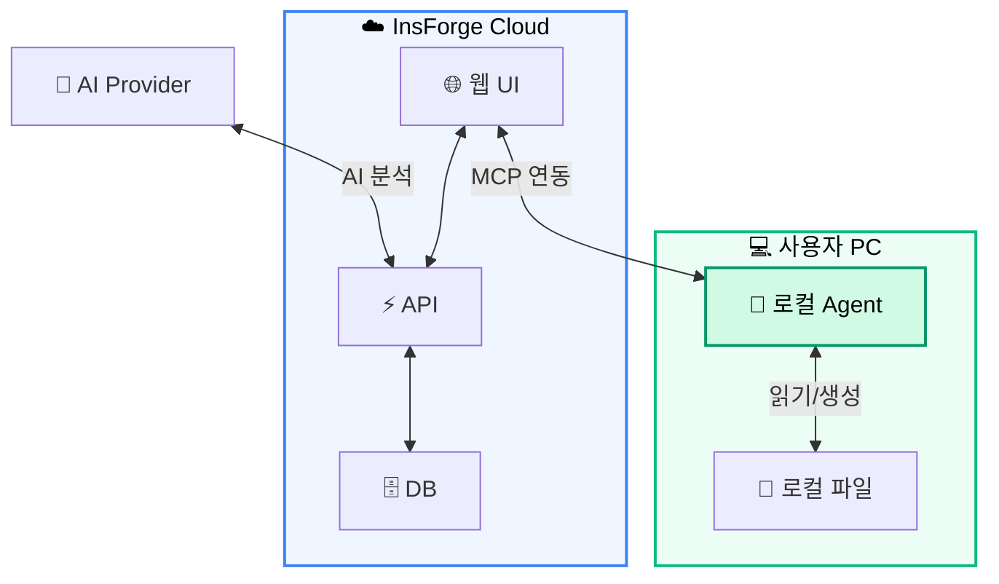
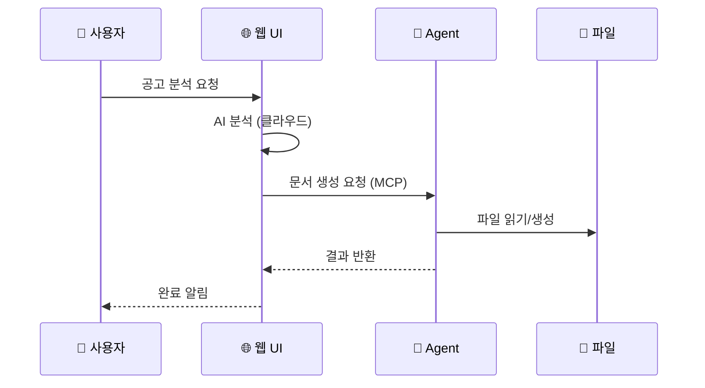
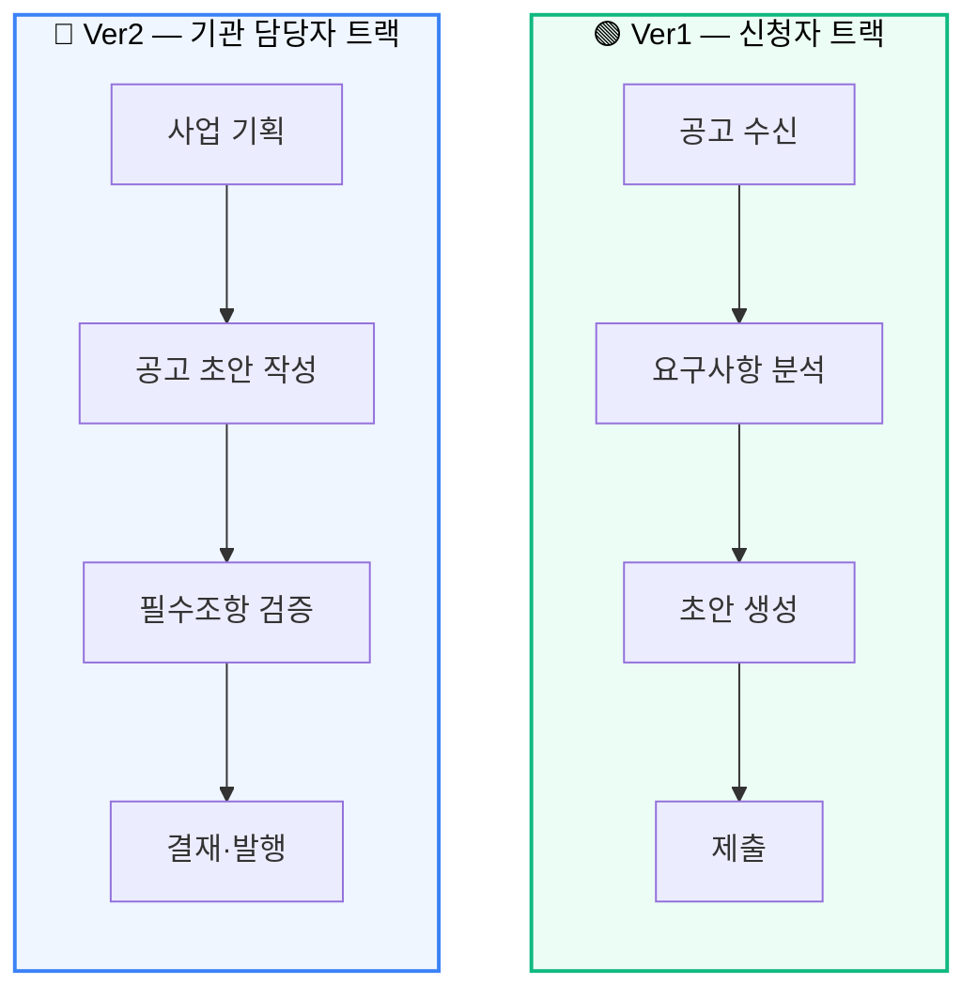
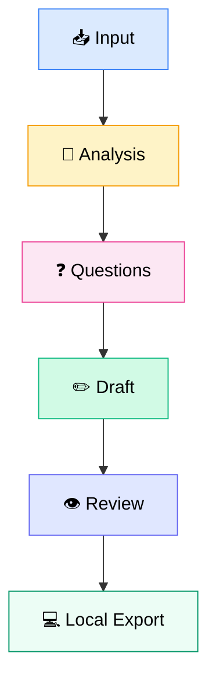
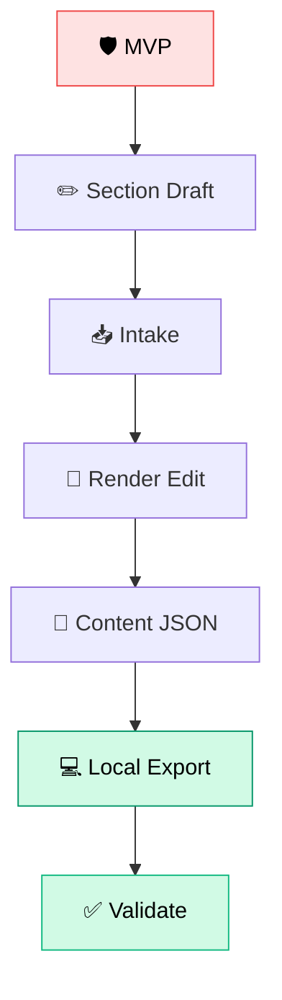
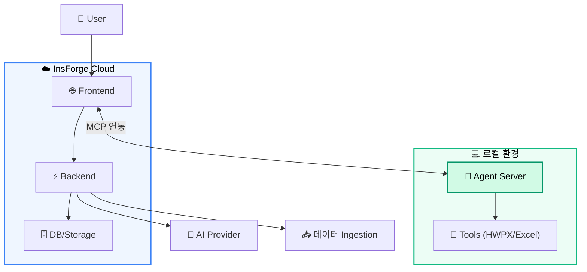

<div align="center">

# 🚀 LiveDock

### 로컬 AI Agent 기반 문서 작성 자동화 플랫폼

[](https://trgf5yzm.insforge.site)
[](#-기술-스택)
[](#-기술-스택)
[](#-기술-스택)

**공모전 · 지원사업 · 장학금 · 연구과제 · 정부 R&D**

사용자의 PC에서 직접 실행되는 **로컬 AI Agent**가<br/>
공고문을 분석하고, 필요한 정보만 질문한 뒤<br/>
**HWPX · Excel · PDF · DOCX 문서를 자동 생성합니다.**

---

<table>
<tr>
<td align="center"><strong>💻 로컬 Agent</strong><br/><sub>사용자 PC에서 직접 실행<br/>파일 접근 · 프라이버시 보장</sub></td>
<td align="center"><strong>🧠 근거 기반 작성</strong><br/><sub>원문에 없는 정보는<br/>절대 생성하지 않습니다</sub></td>
<td align="center"><strong>📄 HWPX 네이티브</strong><br/><sub>한국 공문서 양식을<br/>완벽하게 지원합니다</sub></td>
<td align="center"><strong>🔒 확인 게이트</strong><br/><sub>불확실한 항목은<br/>사용자 확인을 요청합니다</sub></td>
</tr>
</table>

</div>

---

## 📋 목차

- [서비스 개요](#-서비스-개요)
- [로컬 Agent 아키텍처](#-로컬-agent-아키텍처)
- [핵심 기능](#-핵심-기능)
- [Agent Workflow](#-agent-workflow)
- [HWPX 문서 자동화 파이프라인](#-hwpx-문서-자동화-파이프라인)
- [시스템 아키텍처](#-시스템-아키텍처)
- [기술 스택](#-기술-스택)
- [프로젝트 구조](#-프로젝트-구조)
- [시작하기](#-시작하기)
- [문서](#-문서)

---

## 🎯 서비스 개요

LiveDock은 **로컬 AI Agent 기반의 한국 공고문/행정 양식 작성 자동화 플랫폼**입니다.

사용자의 PC에서 직접 실행되는 **로컬 MCP(Model Context Protocol) Agent**가 공고문을 분석하고, 로컬 파일 시스템에 직접 접근하여 HWPX/Excel/PDF 문서를 자동으로 생성합니다.

### 왜 로컬 Agent인가?

> 💡 공고문 작성에는 로컬 파일 접근, 네이티브 앱 연동, 프라이버시 보장이 필수입니다.<br/>
> LiveDock은 **클라우드에서 분석하고, 로컬 Agent가 문서를 생성하는 하이브리드 구조**입니다.

| 클라우드 전용 방식 | LiveDock 로컬 Agent |
|:---------:|:--------:|
| ☁️ 파일 업로드/다운로드 반복 | 💻 **로컬 파일에 직접 접근** |
| 🚫 HWP/HWPX 네이티브 지원 불가 | 📄 **HWPX 직접 생성·편집** |
| 📊 Excel은 CSV 변환만 가능 | 📈 **네이티브 Excel 생성·동기화** |
| 🔓 민감 문서 클라우드 전송 | 🔒 **데이터가 내 PC에 유지** |
| ⏳ 네트워크 지연 | ⚡ **로컬 실행으로 즉시 반영** |

---

## 💻 로컬 Agent 아키텍처

LiveDock의 핵심은 사용자 PC에서 실행되는 **MCP(Model Context Protocol) 서버**입니다.


```mermaid
flowchart TB
    AI["🧠 AI Provider"] <-->|"AI 분석"| API
    
    subgraph CLOUD["☁️ InsForge Cloud"]
        WEB["🌐 웹 UI"] <--> API["⚡ API"] <--> DB["🗄️ DB"]
    end
    
    subgraph LOCAL["💻 사용자 PC"]
        AGENT["🤖 로컬 Agent"] <-->|"읽기/생성"| FS["📁 로컬 파일"]
    end

    WEB <-->|"MCP 연동"| AGENT

    style LOCAL fill:#ecfdf5,stroke:#10b981,stroke-width:2px,color:#000
    style CLOUD fill:#eff6ff,stroke:#3b82f6,stroke-width:2px,color:#000
    style AGENT fill:#d1fae5,stroke:#059669,stroke-width:2px,color:#000
```

### 로컬 Agent 도구 (MCP Tools)

| 도구 | 기능 | 설명 |
|------|------|------|
| 📄 **HWPX 생성** | `create_hwpx` | Markdown/섹션 → 네이티브 HWPX 문서 생성 |
| 🔍 **HWPX 분석** | `analyze_hwpx` | HWPX 양식의 구조·필드·placeholder 분석 |
| 📊 **Excel 생성** | `create_excel` | 분석 결과 → 대시보드·차트 포함 XLSX 생성 |
| 🔄 **Excel 동기화** | `sync_excel` | 사용자 편집 후 양방향 sync-back |
| 📁 **파일 접근** | `read_file` | 로컬 PDF, HWP, 텍스트 파일 직접 읽기 |
| 📋 **PDF 변환** | `convert_to_pdf` | HWPX → PDF 로컬 변환 |

### Agent 연결 흐름


```mermaid
sequenceDiagram
    participant U as 👤 사용자
    participant W as 🌐 웹 UI
    participant A as 🤖 Agent
    participant F as 📁 파일

    U->>W: 공고 분석 요청
    W->>W: AI 분석 (클라우드)
    W->>A: 문서 생성 요청 (MCP)
    A->>F: 파일 읽기/생성
    A-->>W: 결과 반환
    W-->>U: 완료 알림
```

---

## ✨ 핵심 기능

### 🤖 로컬 AI Agent — 문서 자동화

<table>
<tr>
<td width="50%">

**📄 HWPX 네이티브 생성**
- 공고 분석 → 제출서류 HWPX 자동 생성
- 공식 양식 clone/replace 방식 보존
- Namespace fix + 구조 검증 후 출력
- 로컬에서 한글(HWP)로 바로 열기

</td>
<td width="50%">

**📊 Excel 아티팩트 시스템**
- 대시보드 · 제출서류 · 차트 · 원문근거 멀티시트
- openpyxl 기반 스타일링 + 네이티브 차트
- 데스크탑 자동 열기 (`os.startfile`)
- 사용자 편집 후 **양방향 동기화**

</td>
</tr>
<tr>
<td>

**📥 멀티포맷 문서 수집**
- PDF, URL, 텍스트, HWP, HWPX, 엑셀 입력
- IRIS · 기업마당 · K-Startup 공고 자동 연동
- 첨부 파일(CSV/XLSX) 자동 파싱 및 구조화

</td>
<td>

**📤 멀티포맷 내보내기**
- HWPX (한국 표준 문서 형식)
- PDF, DOCX, HTML, Markdown
- Excel (차트 + 스타일링 포함)
- 모두 로컬 파일로 직접 출력

</td>
</tr>
</table>

### 🔬 AI 분석 & 초안 생성

<table>
<tr>
<td width="50%">

**🔬 공고 분석 엔진**
- 마감일, 자격요건, 제출서류, 평가기준, 혜택 추출
- `AnalysisResult` 구조화 JSON 생성
- 평가 루브릭 기반 **AI 자동 스코어링**

</td>
<td width="50%">

**✏️ 섹션별 초안 생성**
- 사업개요, 지원내용, 신청자격, 제출서류 등
- 근거 기반: 원문에 없는 정보 생성 금지
- AI 섹션 재작성 (커스텀 지시사항 지원)

</td>
</tr>
</table>

---

### 🏛️ 기관 워크플로우 (Ver2)

LiveDock은 **두 가지 사용자 트랙**을 동시에 지원합니다:


```mermaid
flowchart TB
    subgraph V1["🟢 Ver1 — 신청자 트랙"]
        direction TB
        A1["공고 수신"] --> A2["요구사항 분석"] --> A3["초안 생성"] --> A4["제출"]
    end

    subgraph V2["🔵 Ver2 — 기관 담당자 트랙"]
        direction TB
        B1["사업 기획"] --> B2["공고 초안 작성"] --> B3["필수조항 검증"] --> B4["결재·발행"]
    end

    style V1 fill:#ecfdf5,stroke:#10b981,stroke-width:2px,color:#000
    style V2 fill:#eff6ff,stroke:#3b82f6,stroke-width:2px,color:#000
```

| | Ver1 · 신청자 트랙 | Ver2 · 기관 담당자 트랙 |
|---|---|---|
| **대상 사용자** | 기업, 대학, 연구팀, 개인 | 기관 담당자 → 팀장 → 기관장 |
| **핵심 입력** | 기존 공고문 + 신청자 정보 | 사업 목적, 예산, 기간, 자격요건 + 이전 공고 |
| **핵심 출력** | 사업계획서/지원서 제출 초안 | 공고문 초안, 발행 가능 문서 |
| **차별화** | 근거 기반 작성, 확인 게이트 | 내부 결재, 버전 관리, 감사 추적 |

<details>
<summary><strong>📖 기관 워크플로우 상세 기능</strong></summary>

| 기능 | 설명 |
|------|------|
| **공고 작성 Agent** | 구조화 입력 → 섹션별 공고 초안, 다중 레시피 (지원사업, 학부연구생 모집 등) |
| **Prior-Notice Recall** | 임베딩 기반 시맨틱 유사 공고 검색, 하이브리드 스코어링 |
| **필수 조항 라이브러리** | 조직별 조항 템플릿, 법적 근거/개인정보 처리/공정경쟁 등 컴플라이언스 게이트 |
| **결재 워크플로우** | `draft → under_review → approving → approved → published` |
| **감사 추적** | 버전별 diff, 섹션별 코멘트, 모든 액션 기록 |
| **근거 추적** | 생성 섹션 ↔ 입력 근거 `source_evidence_ids` 연결 |

</details>

---

### 🔍 공고 디스커버리 허브

**3개 정부 데이터 소스**에서 공고를 실시간으로 수집합니다:

| 소스 | 대상 | 기능 |
|------|------|------|
| 🔬 **IRIS** (iris.go.kr) | 정부 R&D 과제 | 키워드 검색, 접수 상태 필터, 상세 파싱 |
| 🏢 **기업마당** (bizinfo.go.kr) | 중소기업 지원사업 | 공공 API 연동, 분류/부처 필터 |
| 🚀 **K-Startup** (data.go.kr) | 스타트업 지원 공고 | 모집 상태, 지역, 연령 필터 |

- 📌 **원클릭 참조 저장** — 발견한 공고를 즉시 작성 참조 자료로 활용
- 📊 **프로필 매칭 정렬** — 조직 프로필 기반 관련도 자동 평가

---

## 🔄 Agent Workflow

### Ver1 — 신청자 워크플로우


```mermaid
flowchart TB
    A["📥 Input"] --> B["🔬 Analysis"]
    B --> C["❓ Questions"] --> D["✏️ Draft"]
    D --> E["👁️ Review"] --> F["💻 Local Export"]

    style A fill:#dbeafe,stroke:#3b82f6,color:#000
    style B fill:#fef3c7,stroke:#f59e0b,color:#000
    style C fill:#fce7f3,stroke:#ec4899,color:#000
    style D fill:#d1fae5,stroke:#10b981,color:#000
    style E fill:#e0e7ff,stroke:#6366f1,color:#000
    style F fill:#ecfdf5,stroke:#059669,color:#000
```

| 단계 | 역할 | 출력 |
|------|------|------|
| **Input** | 다중 형식 문서 수집 + 공고 디스커버리 허브 | 원문 텍스트 + 첨부 데이터 |
| **Analysis** | 마감일, 자격, 서류, 평가기준, 혜택 추출 | `AnalysisResult` |
| **Questions** | 작성에 필요한 누락 정보만 질문 | `UserInputField` |
| **Draft** | 공고 분석 + 사용자 입력 기반 섹션 초안 | `DraftSection` + source trace |
| **Review** | 인라인 편집, AI 재작성, 루브릭 자가 채점 | 확정된 초안 + 스코어 |
| **Local Export** | 로컬 Agent가 파일 직접 생성 | HWPX, Excel, PDF, DOCX |

---

## 📄 HWPX 문서 자동화 파이프라인

> AI는 **내용 분석과 치환 JSON만** 생성하고, 실제 파일 생성은 HWPX 툴체인 + 로컬 Agent가 담당합니다.


```mermaid
flowchart TB
    S1["🛡️ MVP"] --> S2["✏️ Section Draft"] --> S3["📥 Intake"]
    S3 --> S4["🎨 Render Edit"] --> S5["📝 Content JSON"]
    S5 --> S6["💻 Local Export"] --> S7["✅ Validate"]

    style S1 fill:#fee2e2,stroke:#ef4444,color:#000
    style S6 fill:#d1fae5,stroke:#059669,color:#000
    style S7 fill:#d1fae5,stroke:#10b981,color:#000
```

### 핵심 설계 원칙

| 원칙 | 구현 |
|------|------|
| **🚫 팩트 생성 금지** | 마감일, 기관명, 지원금, 법적 근거 등 원문에 없는 사실은 생성하지 않음 |
| **❓ 불확실성 표시** | `uncertain_fields`, `confirmation_required`로 분류 후 사용자 확인 요청 |
| **🔀 관심사 분리** | AI → 내용 JSON, 로컬 Agent → 파일 생성, Frontend → 사용자 검토 |
| **💻 로컬 퍼스트** | 문서 생성은 사용자 PC에서, 분석은 클라우드에서 |
| **📎 근거 추적** | 모든 생성 콘텐츠에 `source_evidence_ids` + `source_traces` 연결 |

<details>
<summary><strong>📖 Skill 상세 설명</strong></summary>

| Skill | 역할 | 핵심 책임 |
|-------|------|-----------|
| `livedock-agent-mvp` | 제품 범위 고정 | 분석 → 질문 → 초안 → 확인 게이트 → export 흐름 유지 |
| `livedock-section-draft` | 섹션별 초안 | `AnalysisResult` + 사용자 입력으로 초안 생성, `confirmation_required` 유지 |
| `livedock-hwpx-intake` | 양식 분석 | HWP→HWPX 변환, 표/이미지/placeholder 구조 분석 |
| `livedock-hwpx-render-edit` | 영역 편집 | HWPX 미리보기, `source_ref` 기반 XML 치환 대상 관리 |
| `livedock-hwpx-content` | 치환 JSON 생성 | `replacements`, `keywords`, `section_content` 데이터만 생성 |
| `livedock-hwpx-export` | HWPX 생성 | Markdown→HWPX 또는 공식 양식 clone/replace |
| `livedock-hwpx-validate` | 품질 검증 | namespace fix → validate → text extraction 검증 |

</details>

---

## 🏗️ 시스템 아키텍처


```mermaid
flowchart TB
    U["👤 User"] --> FE

    subgraph LOCAL["💻 로컬 환경"]
        AGENT["🤖 Agent Server"] --> TOOLS["🔧 Tools (HWPX/Excel)"]
    end

    subgraph CLOUD["☁️ InsForge Cloud"]
        FE["🌐 Frontend"] --> API["⚡ Backend"] --> DB["🗄️ DB/Storage"]
    end

    FE <-->|"MCP 연동"| AGENT
    API --> AI["🧠 AI Provider"]
    API --> ING["📥 데이터 Ingestion"]
    
    style LOCAL fill:#ecfdf5,stroke:#10b981,stroke-width:2px,color:#000
    style CLOUD fill:#eff6ff,stroke:#3b82f6,stroke-width:2px,color:#000
    style AGENT fill:#d1fae5,stroke:#059669,stroke-width:2px,color:#000
```

### 런타임 책임 분리

| 계층 | 위치 | 책임 |
|------|------|------|
| **로컬 Agent** | 사용자 PC | HWPX/Excel/PDF 생성, 로컬 파일 접근, 네이티브 앱 연동 |
| **Frontend** | InsForge | 업로드, 분석 리뷰, 섹션 편집, 결재 UI, Agent 연결 관리 |
| **Backend** | InsForge | 파싱, AI 호출, Pydantic 검증, workflow 상태, export 오케스트레이션 |
| **AI Provider** | 외부 API | 구조화 JSON 분석, 섹션별 초안/재작성/스코어링 |
| **InsForge** | 클라우드 | Auth, DB(Postgres), Storage, 조직/결재/감사 데이터 |
| **Discovery Hub** | Backend | IRIS/기업마당/K-Startup 공고 수집, 캐싱, 프로필 매칭 |

---

## 🛠️ 기술 스택

<table>
<tr>
<td>

### Frontend


Zustand · Framer Motion · React Dropzone · JSZip

</td>
<td>

### Backend


PyMuPDF · lxml · python-hwpx · httpx · Redis

</td>
</tr>
<tr>
<td>

### Local Agent & 문서


HWPX ZIP/XML Toolchain · python-docx · openpyxl

</td>
<td>

### Infrastructure


InsForge (Auth · Postgres · Storage · Hosting) · TossPayments

</td>
</tr>
</table>

---

## 📁 프로젝트 구조

```
LiveDock/
├── 🤖 docklive-inline-agent/       ⭐ 로컬 MCP Agent 서버
│   ├── src/
│   │   ├── server.py               MCP 서버 엔트리포인트 (localhost:8765)
│   │   └── tools/                  Agent 도구 (HWPX, Excel, PDF, 파일)
│   ├── corpus/                     참조 데이터 · 템플릿
│   ├── tests/                      Agent 테스트
│   └── build/                      배포 빌드
│
├── 🌐 frontend/                    Next.js 14 프론트엔드
│   ├── app/                        App Router (auth, dashboard, workspace, result)
│   ├── components/                 UI 컴포넌트 (20개 모듈)
│   │   ├── projects/LocalAgentPanel.tsx  ⭐ 로컬 Agent 연결 UI
│   │   ├── agency/                 기관 워크플로우 (결재, 공고 편집)
│   │   ├── livedock/               핵심 Agent UI (분석, 초안, 리뷰)
│   │   ├── workspace/              워크스페이스 (멀티파일, 블루프린트)
│   │   └── ui/                     공통 UI
│   ├── lib/                        API 클라이언트, 타입, 상태 관리
│   └── hooks/                      커스텀 React hooks
│
├── ⚡ backend/                     FastAPI Agent 백엔드
│   ├── main.py                     앱 엔트리포인트
│   ├── routers/                    API 라우터 (8개)
│   ├── services/                   비즈니스 로직 (32개 서비스)
│   │   ├── analyzer.py             공고 분석 엔진
│   │   ├── drafting_service.py     섹션별 초안 생성
│   │   ├── agency_noticeops.py     기관 공고 운영 + 결재
│   │   ├── prior_notice_recall.py  시맨틱 유사 공고 검색
│   │   ├── scoring_service.py      루브릭 기반 AI 자가 채점
│   │   ├── excel_artifacts.py      Excel 아티팩트 생성/동기화
│   │   └── storage.py              InsForge 파일 저장소
│   ├── hwpx_toolchain/             HWPX 변환·검증 도구 체인
│   └── models/schemas.py           Pydantic API 스키마
│
├── 🗃️ migrations/                  InsForge/Postgres 마이그레이션 (6개)
├── 🔧 harness/                     Agent 품질 게이트·검증 시스템
├── 📚 docs/                        프로젝트 문서
├── 🛠️ tools/                       개발 보조 도구
└── 📜 scripts/                     실행 스크립트
```

---

## 🚀 시작하기

### 필수 요구사항

- **Python** 3.11+
- **Node.js** 18+ / **npm** 9+
- **OpenAI API Key** 또는 **Gemini API Key**

### 1. 로컬 Agent 실행

```bash
# Agent 서버 시작 (사용자 PC)
cd docklive-inline-agent
pip install -r requirements.txt
python src/server.py
# → MCP Server running at localhost:8765
```

### 2. Backend 실행

```bash
cd backend
pip install -r requirements.txt
uvicorn main:app --reload --port 8000
```

### 3. Frontend 실행

```bash
cd frontend
npm install
npm run dev
```

### 하네스 품질 게이트

```powershell
.\scripts\harness.ps1 -Profile quick      # 빠른 검증
.\scripts\harness.ps1 -Profile backend     # 백엔드 계약 테스트
.\scripts\harness.ps1 -Profile agent       # Agent E2E 평가
.\scripts\harness.ps1 -Profile frontend    # Next.js 빌드 검증
.\scripts\harness.ps1 -Profile full        # 전체 게이트
.\scripts\harness.ps1 -Profile hwpx        # HWPX 생성·검증
```

---

## 예시
```bash
cd backend
pip install -r requirements.txt
uvicorn main:app --reload --port 8000
```

### 3. Frontend 실행

```
엑셀 시각화/집계

구 단위로 지역별 주택 수를 집계해서 표와 막대 차트가 있는 시트를 추가한 엑셀 완성본을 만들어줘.
공급형(단독/다가구 등) 유형별로 개수를 집계해서 원형 차트로 보여줘.
전용면적 평균을 지역별로 계산해서 비교표로 만들어줘.
필터링/추출

전용면적이 20㎡ 이상인 주택만 추려서 새 시트에 정리해줘.
강남구, 서초구, 송파구만 따로 뽑아서 요약표를 만들어줘.
HWPX 신청서 연동 (신청서 양식을 같이 첨부했을 때)

이 주택목록을 근거자료로 써서, 첨부한 HWPX 신청서의 입주 신청 사유란을 채워줘.
```

## 📚 문서

| 문서 | 설명 |
|------|------|
| [Architecture](./docs/engineering/architecture.md) | 시스템 아키텍처 상세 |
| [Deployment](./docs/engineering/deployment.md) | 배포 가이드 |
| [Agent Harness](./docs/agent/agent-harness.md) | 품질 게이트 운영 |
| [Skills & Patterns](./docs/agent/skills.md) | Agent Skill 기술 패턴 |
| [HWPX Workflow](./docs/hwpx/gemma-hwpx-workflow.md) | HWPX 자동화 워크플로우 |
| [Evaluation](./docs/evaluation/evals.md) | Agent 평가 기준 |
| [Local Agent](./docklive-inline-agent/ARCHITECTURE.md) | 로컬 Agent 아키텍처 |

---

<div align="center">

**Built with 💻 Local-First AI Agent Architecture**

*LiveDock — 내 PC의 AI Agent가 공고 분석부터 문서 작성까지 자동화합니다.*

</div>
