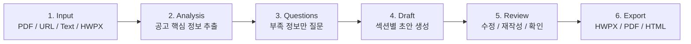
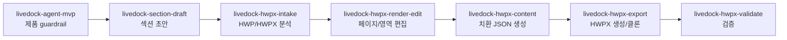
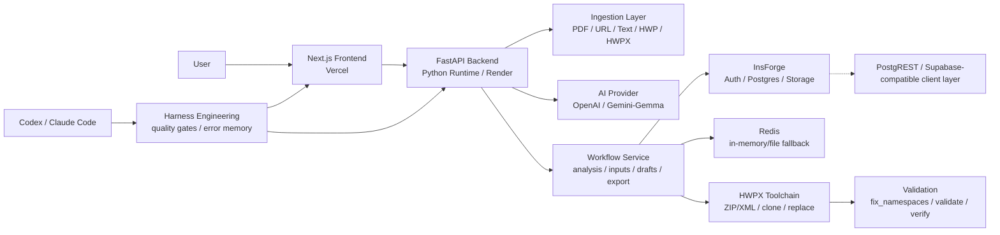

# LiveDock

> 한국 공고문과 HWPX 양식을 제출용 문서로 바꾸는 Agent MVP

공모전, 지원사업, 장학금, 연구과제등등 여러 공고문을 PDF, URL, 텍스트, HWP/HWPX 양식으로 입력하면 LiveDock이 요구사항을 분석하고, 부족한 정보만 질문한 뒤, 섹션별 초안을 생성해 **HWPX, PDF, HTML**로 내보냅니다.

**Production:** [dock-live.vercel.app](https://dock-live.vercel.app)

---

## 서비스 핵심 개요

LiveDock은 Korean ver. 공고문/행정 양식 작성에 특화된 문서 자동화 Agent입니다. 
사용자가 공고문을 하나하나 해석하고 HWPX 양식을 직접 채우는 부담을 줄이는 것이 목표입니다.

핵심 원칙은 **근거 기반 작성**입니다. Agent는 공고 원문에 없는 마감일, 기관명, 지원금, 자격요건, 제출 방법을 임의로 만들지 않습니다. 
불확실한 값은 `uncertain_fields` 또는 `confirmation_required`로 남기고 사용자 확인을 요청합니다.

---

## 워크플로우


```mermaid
flowchart LR
  A["1. Input<br/>PDF / URL / Text / HWPX"] --> B["2. Analysis<br/>공고 핵심 정보 추출"]
  B --> C["3. Questions<br/>부족 정보만 질문"]
  C --> D["4. Draft<br/>섹션별 초안 생성"]
  D --> E["5. Review<br/>수정 / 재작성 / 확인"]
  E --> F["6. Export<br/>HWPX / PDF / HTML"]
```

| 단계 | 역할 | 주요 결과 |
| --- | --- | --- |
| Input | PDF, URL, 텍스트, HWP/HWPX 양식 입력 | 원문 또는 양식 파일 |
| Analysis | 마감일, 자격, 제출서류, 평가기준, 혜택 추출 | `AnalysisResult` |
| Questions | 작성에 필요한 사용자별 누락 정보만 수집 | `UserInputField` |
| Draft | 공고 분석과 사용자 입력을 근거로 섹션별 초안 생성 | `DraftSection` |
| Review | 인라인 편집, AI 재작성, 확인 필요 항목 검토 | `confirmation_required` |
| Export | 최종 문서를 검증 가능한 형식으로 내보내기 | HWPX, PDF, HTML |

---

## MVP 범위

| 기능          | 의미                                                               |
| ----------- | ---------------------------------------------------------------- |
| 문서 입력       | PDF, URL, 텍스트, HWP/HWPX 양식을 넣을 수 있음                              |
| 공고 분석       | 마감일, 자격요건, 제출서류, 평가기준 등을 구조화해서 추출                                |
| 부족 정보 질문    | AI가 작성에 필요한 정보 중 빠진 것만 사용자에게 질문                                  |
| 섹션별 초안 생성   | 사업계획서, 지원서, 신청서 항목별로 초안 작성                                       |
| 사용자 확인 게이트  | 불확실한 내용은 임의로 확정하지 않고 사용자 확인 필요로 표시                               |
| HWPX export | 최종 문서를 HWPX 중심으로 생성                                              |

---

## HWPX 문서 자동화 Skills

AI가 HWPX파일을 직접 생성하는 구조가 아니라 , 미리 만들어둔 skills에 따라 단계별로 문서를 분석하고 작성하고 생성해내는 구조



```mermaid
flowchart LR
  A["livedock-agent-mvp<br/>제품 guardrail"] --> B["livedock-section-draft<br/>섹션 초안"]
  B --> C["livedock-hwpx-intake<br/>HWP/HWPX 분석"]
  C --> D["livedock-hwpx-render-edit<br/>페이지/영역 편집"]
  D --> E["livedock-hwpx-content<br/>치환 JSON 생성"]
  E --> F["livedock-hwpx-export<br/>HWPX 생성/클론"]
  F --> G["livedock-hwpx-validate<br/>검증"]
```

| Skill | 역할 | 핵심 책임 |
| --- | --- | --- |
| `livedock-agent-mvp` | 제품 범위 고정 | 공고 분석, 부족 정보 질문, 섹션 초안, 확인 게이트, export 흐름을 Agent MVP 안에 유지 |
| `livedock-section-draft` | 섹션별 초안 생성 | `AnalysisResult`와 사용자 입력만 사용해 작성 항목별 초안을 만들고 `confirmation_required` 유지 |
| `livedock-hwpx-intake` | HWP/HWPX 입력 분석 | `.hwp`는 `.hwpx`로 변환하고, 업로드 양식의 표/이미지/빈 칸/placeholder 구조를 분석 |
| `livedock-hwpx-render-edit` | 양식 미리보기와 영역 편집 | HWPX 페이지 preview, editable region, `source_ref` 기반 XML 치환 대상을 관리 |
| `livedock-hwpx-content` | 치환 데이터 생성 | AI가 HWPX 파일을 직접 만들지 않고 `replacements`, `keywords`, `section_content` JSON만 생성 |
| `livedock-hwpx-export` | 실제 HWPX 생성 | 일반 문서는 Markdown-to-HWPX, 공식 양식은 clone/replace 방식으로 표, 이미지, 스타일 보존 |
| `livedock-hwpx-validate` | export 품질 게이트 | `fix_namespaces.py`, `validate.py`, `verify_hwpx.py`, 텍스트 추출 검증 후 파일 제공 |
| `livedock-hwp-mcp-local` | 로컬 HWP 보조 도구 | Windows/Hancom HWP가 있는 개발 환경에서만 렌더링 확인이나 수동 점검에 사용 |
| `hwpx` global skill | HWPX toolchain workflow | Markdown/Text to HWPX, placeholder replacement, form clone, official writing rules, HWP to HWPX conversion |

HWPX Skills는 “AI가 문서를 직접 만드는 구조”가 아니라, AI는 내용과 치환 JSON만 만들고, 
backend와 HWPX toolchain이 실제 파일 생성과 검증을 담당하게 분리한 안전한 문서 자동화 설계입니다.

---

## 기술 아키텍처


```mermaid
flowchart LR
  U["User"] --> FE["Next.js Frontend<br/>Vercel"]
  FE --> API["FastAPI Backend<br/>Python Runtime / Render"]

  API --> Parser["Ingestion Layer<br/>PDF / URL / Text / HWP / HWPX"]
  API --> AI["AI Provider<br/>OpenAI / Gemini-Gemma"]
  API --> Workflow["Workflow Service<br/>analysis / inputs / drafts / export"]
  Workflow --> Store["InsForge<br/>Auth / Postgres / Storage"]
  Store -.-> PgApi["PostgREST / Supabase-compatible client layer"]
  Workflow --> Cache["Redis<br/>in-memory/file fallback"]
  Workflow --> HWPX["HWPX Toolchain<br/>ZIP/XML / clone / replace"]
  HWPX --> Validate["Validation<br/>fix_namespaces / validate / verify"]

  Dev["Codex / Claude Code"] --> Harness["Harness Engineering<br/>quality gates / error memory"]
  Harness --> API
  Harness --> FE
```

### 런타임 책임 분리

- **Frontend**: 업로드, 분석 결과 검토, 사용자 입력, 섹션 초안 리뷰, export UI
- **Backend**: 파싱, AI provider 호출, Pydantic 검증, workflow 상태, export orchestration
- **AI Provider**: 구조화 JSON 분석과 섹션별 초안 생성
- **InsForge**: 사용자/auth, 분석 결과, workflow session, 업로드 문서, 생성 export 저장
- **HWPX Toolchain**: 실제 `.hwpx` 패키지 생성, 공식 양식 clone/replace, 검증
- **Harness**: 반복 가능한 품질 게이트와 오류 fingerprint 관리

---

## 기술 스택

| 영역 | 사용 기술 |
| --- | --- |
| Frontend | Next.js 14 App Router, React 18, TypeScript, Tailwind CSS |
| Frontend State/UI | Zustand, React Dropzone, Framer Motion |
| Backend | FastAPI, Python 3.11+, Pydantic |
| AI | OpenAI API, Gemini/Gemma provider option |
| 문서 파싱 | PyMuPDF, URL ingestion, HWP/HWPX intake |
| HWPX | ZIP/XML toolchain, `lxml`, `python-hwpx`, HWPX clone/replace scripts |
| Persistence | InsForge Auth, Postgres, Storage |
| Data API Layer | PostgREST / Supabase-compatible client layer through InsForge SDK |
| Cache/Fallback | Redis, in-memory/file cache |
| Export | HWPX, PDF, editable HTML fallback |
| Deployment | Vercel frontend, Render or Vercel-compatible Python backend |
| Verification | `scripts/harness.ps1`, backend contracts, agent eval, frontend build, HWPX validation |

---

## 프로젝트 구조

```text
LiveDock/
  frontend/                    Next.js 사용자 화면
    app/                       App Router 페이지와 workflow 화면
    components/                업로드, 리뷰, 문서 편집 UI 컴포넌트
    hooks/                     frontend 공통 hooks
    lib/                       API client, 타입, 상태, InsForge client
    public/                    정적 asset
    __tests__/                 frontend unit/e2e tests

  backend/                     FastAPI Agent backend
    main.py                    app entrypoint, CORS, router 등록
    core/                      설정, 공통 오류, runtime config
    models/                    Pydantic API contracts
    routers/                   analyze, workflow, hwpx, notices API
    services/                  파싱, AI, 초안, 저장, export 로직
    hwpx_toolchain/            HWPX clone/fix/validate scripts
    tests/                     contract, eval, manual HWPX tests

  harness/                     Agent 검증/운영 하네스
    state-spec.yaml            제품 불변 조건과 Agent 계약
    quality-gates.yaml         quick/backend/agent/frontend/full/hwpx profile
    memory/                    durable project/user workflow memory
    errors/                    반복 실패 fingerprint registry
    roles/                     Codex, Claude Code 역할 정의
    handoffs/                  Claude Code handoff 템플릿

  docs/                        프로젝트 문서
    product/                   제품 계획, 데모, 요구사항
    engineering/               아키텍처, 배포, InsForge, 환경 설정
    agent/                     skills, harness, MCP 경계 문서
    hwpx/                      HWPX workflow와 HWP MCP 가이드
    evaluation/                평가 기준과 fixture 설명
    examples/                  예시 문서와 샘플 자료

  tools/                       개발/검증 보조 도구
    harness/                   harness runner, error memory, handoff 생성
    hwp-mcp/                   Windows/Hancom HWP 로컬 MCP helper

  scripts/                     로컬 실행 wrapper와 harness entrypoint
  migrations/                  InsForge/Postgres schema migration
  .claude/skills/              LiveDock 단계별 Agent skill 정의
  .github/                     GitHub Actions workflow
```

`node_modules`, `.next`, `venv`, `.tmp`, `.pytest_cache`, `.livedock_storage`, `logs`, `outputs`, `harness/runs` 같은 설치물, 캐시, 실행 로그, 생성 산출물은 README 구조에서 제외합니다.

---


## 문서

- [Architecture](./docs/engineering/architecture.md)
- [Deployment](./docs/engineering/deployment.md)
- [Agent Harness](./docs/agent/agent-harness.md)
- [Skills and Technical Patterns](./docs/agent/skills.md)
- [HWPX Workflow](./docs/hwpx/gemma-hwpx-workflow.md)
- [Evaluation](./docs/evaluation/evals.md)
