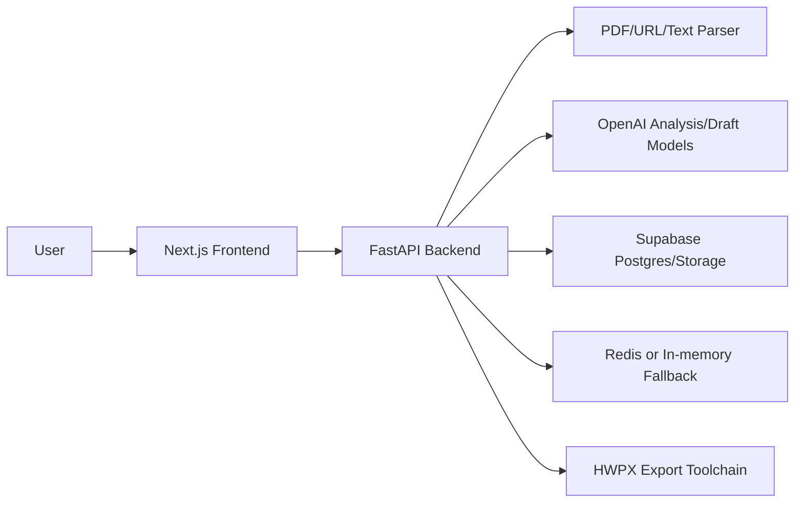

# LiveDock Architecture

## System Overview

LiveDock은 Next.js 프론트엔드와 FastAPI 백엔드로 구성됩니다. Supabase는 v1 목표 persistence/auth/storage 플랫폼이며, Redis와 in-memory cache는 로컬 개발과 장애 상황의 fallback입니다.

## Core Data Flow

1. 사용자가 PDF, URL, 텍스트 중 하나로 공고를 입력한다.
2. 백엔드는 텍스트를 추출하거나 URL 본문을 수집한다.
3. Analysis Agent가 공고 요구사항을 JSON으로 추출한다.
4. 백엔드는 `AnalysisResult`를 검증하고 D-day, fallback section 등을 보강한다.
5. Workflow session을 생성한다.
6. 프론트엔드는 필수 입력 필드를 보여 준다.
7. Draft Agent가 섹션별 초안을 생성한다.
8. 사용자가 피드백을 저장하고 수정 요청을 보낸다.
9. 사용자가 확인하면 최종 문서를 생성한다.
10. HTML export를 기본 제공하고, HWPX toolchain 설정 시 HWPX export를 제공한다.

## Public API

| Method | Path | Purpose |
| --- | --- | --- |
| `POST` | `/api/analyze` | PDF 분석 및 workflow 생성 |
| `POST` | `/api/analyze/text` | 붙여넣은 공고 텍스트 분석 |
| `POST` | `/api/analyze/url` | 공고 URL 수집 및 분석 |
| `GET` | `/api/result/{id}` | 분석 결과 조회 |
| `GET` | `/api/workflow/{id}` | workflow 조회 |
| `POST` | `/api/workflow/{id}/inputs` | 사용자 입력 저장 |
| `POST` | `/api/workflow/{id}/draft` | 섹션별 초안 일괄 생성 |
| `GET` | `/api/workflow/{id}/draft/stream` | 섹션 단위 draft stream 이벤트 |
| `POST` | `/api/workflow/{id}/draft/{section_id}/feedback` | 섹션 피드백 저장 |
| `POST` | `/api/workflow/{id}/draft/{section_id}/revise` | 피드백 반영 |
| `POST` | `/api/workflow/{id}/confirm` | 사용자 확인 |
| `POST` | `/api/workflow/{id}/finalize` | 최종 문서 생성 |
| `GET` | `/api/workflow/{id}/export/html` | HWP 호환 HTML export |
| `GET` | `/api/workflow/{id}/export/hwpx` | HWPX export |

## Key Contracts

- `AnalysisResult`: 공고 분석 결과, 제출서류, 작성 항목, 불확실 항목, 원문 근거를 담는다.
- `WorkflowSession`: 분석 결과, 사용자 입력, 초안, 최종 문서 상태를 담는다.
- `DraftSection`: 섹션별 초안과 `confirmation_required`를 담는다.
- `DraftStreamEvent`: draft stream의 section start/done/error 이벤트를 표현한다.
- `ExportResponse`: HTML은 text, HWPX는 base64 content로 반환한다.

## Storage Strategy

v1 목표:

- Supabase Postgres: analysis/workflow/final document persistence
- Supabase Storage: uploaded source documents and generated exports
- Supabase Auth: v2 community and user history

현재 fallback:

- Redis: workflow/result TTL cache
- In-memory cache: 로컬 개발 fallback

Production에서는 in-memory cache만으로 workflow를 유지하지 않습니다.

## HWPX Export Strategy

LiveDock은 `jkf87/hwpx-skill` 방향을 따릅니다.

- Markdown/Text를 HWPX toolchain으로 변환한다.
- 생성 후 `fix_namespaces.py`를 반드시 실행한다.
- `validate.py`로 구조 검증을 통과해야 한다.
- 복잡한 HWPX 공식 서식 파일이 주어지면 XML 재작성보다 form cloning을 우선한다.
- `.hwp` 입력은 HWPX로 변환한 뒤 처리한다.

현재 API는 optional toolchain 방식입니다. `HWPX_EXPORT_ENABLED=true`와 `HWPX_SKILL_DIR`이 설정되어야 `/export/hwpx`가 동작합니다.
