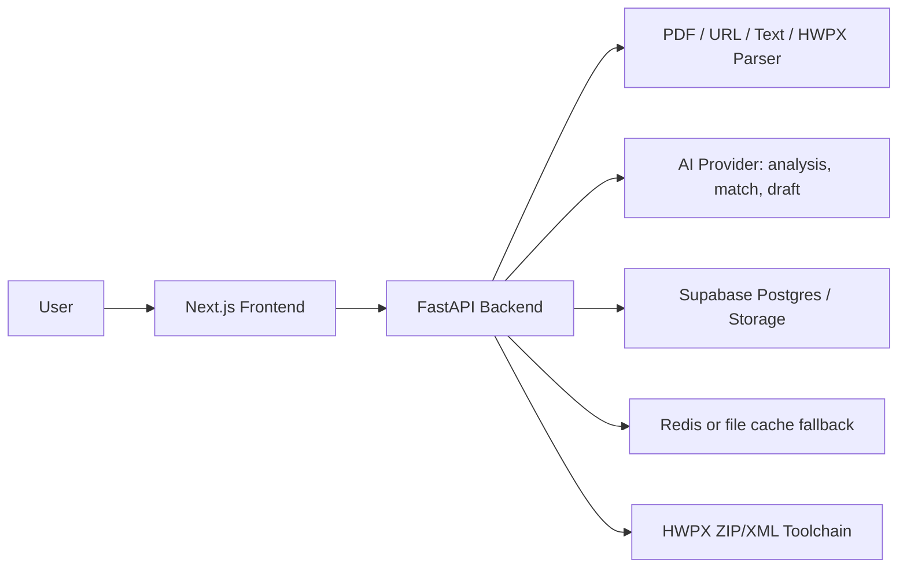

# LiveDock Architecture

## System Overview

LiveDock는 Next.js 프론트엔드와 FastAPI 백엔드로 구성된 문서 자동화 Agent 서비스입니다. 현재 제품 우선순위는 커뮤니티가 아니라 Agent MVP 안정화입니다.

## Core Data Flow

1. 사용자가 PDF, URL, 텍스트, HWPX/HWP 중 하나로 공고 또는 양식을 입력합니다.
2. 백엔드는 원문 텍스트를 추출하고 분석 Agent에 전달합니다.
3. 분석 결과는 `AnalysisResult` JSON으로 정규화되며, 마감일/자격/제출서류/평가기준에는 가능한 경우 source evidence가 붙습니다.
4. workflow session이 생성되고, 필요한 사용자 입력 항목만 `UserInputField`로 수집합니다.
5. Draft Agent는 공고 분석 결과와 사용자 입력만 근거로 섹션별 초안을 생성합니다.
6. 확인이 필요한 주장과 불확실한 항목은 `confirmation_required`와 `uncertain_fields`로 유지합니다.
7. 사용자가 확인하면 final document를 만들고, HTML/HWPX/템플릿 HWPX/placeholder map export로 이어집니다.
8. export 결과는 성공/실패/검증 실패 상태와 validation summary를 함께 저장합니다.

## Public API

| Method | Path | Purpose |
| --- | --- | --- |
| `GET` | `/health` | Backend health check |
| `POST` | `/api/analyze` | PDF/HWPX/HWP 업로드 분석 및 workflow 생성 |
| `POST` | `/api/analyze/text` | 붙여넣은 공고 텍스트 분석 |
| `POST` | `/api/analyze/url` | 공고 URL 수집 및 분석 |
| `GET` | `/api/result/{id}` | 분석 결과 조회 |
| `GET` | `/api/workflow/{id}` | workflow 조회 |
| `POST` | `/api/workflow/{id}/inputs` | 사용자 입력 저장 |
| `POST` | `/api/workflow/{id}/draft` | 섹션별 초안 일괄 생성 |
| `GET` | `/api/workflow/{id}/draft/stream` | 섹션별 draft stream |
| `POST` | `/api/workflow/{id}/draft/{section_id}/feedback` | 섹션 피드백 저장 |
| `POST` | `/api/workflow/{id}/draft/{section_id}/revise` | 피드백 기반 섹션 수정 |
| `POST` | `/api/workflow/{id}/confirm` | 사용자 확인 처리 |
| `POST` | `/api/workflow/{id}/finalize` | 최종 문서 생성 |
| `GET` | `/api/workflow/{id}/export/html` | editable HTML export |
| `GET` | `/api/workflow/{id}/export/hwpx` | 최종 문서 HWPX export |
| `POST` | `/api/workflow/{id}/export/hwpx/placeholder-map` | HWPX placeholder mapping JSON 생성 |
| `POST` | `/api/workflow/{id}/export/hwpx/template` | 업로드 HWPX 공식 양식 클로닝 export |
| `GET` | `/api/workflow/{id}/exports` | 저장된 export history 조회 |
| `GET` | `/api/workflow/{id}/exports/{export_id}` | 저장된 export 다운로드 |
| `GET` | `/api/hwpx/status` | 서버 HWPX toolchain readiness 조회 |
| `POST` | `/api/hwpx/compose` | standalone HWPX 자동 작성 MVP |
| `POST` | `/api/hwpx/convert-hwp` | HWP를 HWPX로 변환 |

## Key Contracts

- `AnalysisResult`: 공고 분석 결과, 제출서류, 작성 항목, 불확실 항목, 원문 근거, 부족 정보 질문을 포함합니다.
- `WorkflowSession`: 분석 결과, 사용자 입력, 초안, 최종 문서 상태를 포함합니다.
- `DraftSection`: 섹션별 초안, 관련 평가기준, source evidence id, 확인 필요 주장을 포함합니다.
- `ExportResponse`: export content와 함께 warnings, validation summary를 반환합니다.
- `ExportMetadata`: 저장된 export 파일의 상태(`success`, `failed`, `validation_failed`)와 오류/검증 요약을 포함합니다.
- `HwpxStatusResponse`: HWPX export 가능 여부, skill/toolchain 위치, 필수 script 존재 여부, 경고를 반환합니다.

## Storage Strategy

Production 목표는 Supabase입니다.

- Supabase Postgres: analysis, workflow, export metadata
- Supabase Storage: uploaded source documents and generated exports
- Redis/file cache: 개발 및 장애 fallback

Production에서 in-memory/file cache만으로 workflow를 유지하면 서버 재시작 시 사용자 작업이 사라질 수 있습니다. 배포 환경에서는 Supabase 연결과 Storage bucket을 먼저 확인해야 합니다.

## HWPX Export Strategy

LiveDock의 최종 한국 문서 포맷은 HWPX입니다.

- 일반 최종 문서는 Markdown/Text to HWPX toolchain으로 생성합니다.
- 모든 HWPX 생성 후 `fix_namespaces.py`와 `validate.py`를 실행합니다.
- `text_extract.py` 결과를 validation summary에 저장해 제목/본문 존재 여부를 확인합니다.
- 복잡한 공식 신청서 양식은 새 XML 생성보다 form cloning을 우선합니다.
- 템플릿 클로닝은 `clone_form.py`, `fix_namespaces.py`, `validate.py`, `verify_hwpx.py` 순서로 검증합니다.
- HWP 입력은 HWPX로 변환한 뒤 분석 또는 양식 처리로 이어갑니다.

HWPX가 실패해도 사용자가 작업을 잃지 않도록 HTML export와 placeholder map은 항상 fallback 경로로 유지합니다.
