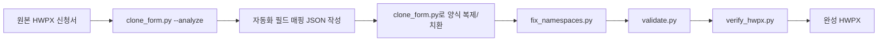

# WithUS HWPX 신청서 자동화 워크플로

이 예시는 `hwpx` skill의 Workflow F, 즉 기존 HWPX 양식을 복제한 뒤 텍스트만 치환하는 방식으로 WithUS 동아리 참여신청서를 자동화한 기록입니다.

## 처리 흐름



## 이번 실행 결과

- 매핑 파일: `docs/examples/withus_hwpx/withus_sample_map.json`
- 결과 파일: `docs/examples/withus_hwpx/withus_sample_filled.hwpx`
- 구조 검증: PASS
- 원본 대비 구조 보존 검증: PASS

원본 양식 파일은 개인 다운로드 폴더에 있었기 때문에 저장소에는 포함하지 않습니다.

## Agent MVP 확장 방향

서비스에서는 사용자가 업로드한 HWPX 공식 양식을 대상으로 다음 순서로 처리합니다.

1. 공고 PDF, URL, 붙여넣기 텍스트 또는 fixture를 분석한다.
2. 신청자명, 팀 정보, 지원 동기, 활동 목표, 운영 방법, 예산 계획처럼 사용자 입력이 필요한 항목을 생성한다.
3. 누락된 정보만 사용자에게 질문한다.
4. 답변과 공고 제약을 합쳐 section-level draft를 만든다.
5. 사용자가 중요한 주장과 개인정보를 확인하면 치환 JSON을 만든다.
6. HWPX 원본 양식을 복제하고 텍스트만 치환한다.
7. namespace 보정, 구조 검증, 원본 대비 검증을 통과한 HWPX만 다운로드 대상으로 제공한다.

## API 연결

현재 백엔드는 다음 endpoint로 HWPX 템플릿 클로닝을 지원합니다.

```text
POST /api/workflow/{workflow_id}/export/hwpx/template
```

multipart form fields:

- `template`: 업로드할 `.hwpx` 공식 양식
- `replacements_json`: 추가 치환 map JSON. 비워 두면 `{}` 사용
- `keywords_json`: `<hp:t>` 내부 키워드 치환 map JSON. 비워 두면 `{}`

기본 placeholder:

- `{{title}}`
- `{{content}}`
- `{{applicant_name}}`
- `{{applicant_profile}}`
- `{{project_summary}}`
- `{{evidence}}`
- `{{organization}}`
- `{{announcement_title}}`
- `{{section:section-1}}`
- `{{section:문제 정의}}`
